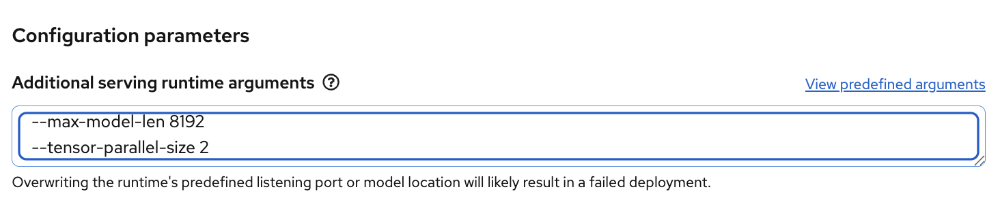

# Introduction

This guide provides a walkthrough for setting up and using Red Hat OpenShift AI and Red Hat Inference Server for model deployment and inference. It covers environment requirements, GPU configurations, software dependencies, and practical examples for serving both full-weight and quantized models.

Additionally, it demonstrates benchmarking, integration with OpenAI-compatible endpoints, enabling efficient multi-GPU model serving and evaluation.


## Important Disclaimer

> IMPORTANT DISCLAIMER: Read before proceed!
>
> 1. These examples are to showcase the capabilities of OpenShift AI.
> 1. Certain components may not be supported if they are using upstream projects.
> 1. Always check with Red Hat or your account team for supportability.

## Chapters

1. [Changelog](#changelog)
1. [Requirements](#requirements)
1. [Environment Setup](#environment-setup)
1. [Demo](#demo)
1. [Appendix](#appendix)

## Changelog

| Date | Description |
| :---- | :---- |
| 30 Aug 2025 | Based on RHOAI 2.23 and RHAIIS 3.2.1 |

## Requirements

* x86 architecture
* Nvidia GPU. Will work on AMD too.

### Single Node OpenShift

| Type | Qty | vCPU | Memory (GB) | Disk (GB) |
| :---- | :---- | :---- | :---- | :---- |
| SNO | 1 | 32 | 64 | 200 |

### OpenShift Cluster

| Type | Qty | vCPU | Memory (GB) | Disk (GB) |
| :---- | :---- | :---- | :---- | :---- |
| Control plane | 1 | 8 | 16 | 200 |
| CPU Worker | 2 | 16 | 32 | 200 |

### Nvidia GPU

* Ada Lovelace: L4, L20, L40S (no MIG, no NVLink)  
* Ampere: A100  (\>=A40 for MIG)  
* Hopper: H20, H100, H200  
* Blackwell: B200

| GPU Model | INT4 | FP8 | FP16 | BF16 |
| :---- | :---- | :---- | :---- | :---- |
| L4 | Supported | Supported | Supported | Supported |
| L20 | Supported | Supported | Supported | Supported |
| L40s | Supported | Supported | Supported | Supported |
| A100 | Supported | Supported | Supported | Supported |
| H20 | Supported | Supported | Supported | Supported |
| H100 | Supported | Supported | Supported | Supported |
| H200 | Supported | Supported | Supported | Supported |
| B200 | Not Supported | Supported | Supported | Supported |

* It is recommended to deploy additional GPU worker node(s) with 1 or more GPU.
* The quantity and type of GPU depends on the type of tests being done. E.g.
  * Model size
  * Number of models
  * Benchmarking
  * Number of GPU required (tensor parallelism)
  * NVLink required
  * Concurrency test (RPS)

This demo has been done on AWS using:

* g6.12xlarge: x4 Nvidia L4
* g6e.12xlarge: x4 Nvidia L40S

On AWS, you can run `scripts/add-gpu-machineset.sh` to add GPU worker nodes. This will add a new `machineset` for the given aws instance type. Be aware that not all AZ has the GPU instance type.

```bash
scripts/add-gpu-machineset.sh ocp-c6bsh-bxjl2-worker-ap-northeast-1c p4d.24xlarge --help
Usage: scripts/add-gpu-machineset.sh [--list] | <old_machineset> <new_instance_type> [--dry-run] [--on-demand]

Options:
  --list             Show all current MachineSets in openshift-machine-api and exit
  --dry-run          Optional flag to print YAML without applying it
  --on-demand        Use on-demand instances instead of spot
  --help, -h         Show this help message

Clone an OpenShift MachineSet to a new instance type. By default, the new MachineSet
will use spot instances unless --on-demand is specified. The generated MachineSet will
always have replicas=0 and a name suffix based on GPU count and type.

Examples:
  scripts/add-gpu-machineset.sh --list
  scripts/add-gpu-machineset.sh ocp-c6bsh-bxjl2-worker-ap-northeast-1a g6.4xlarge --dry-run
  scripts/add-gpu-machineset.sh ocp-c6bsh-bxjl2-worker-ap-northeast-1a p4d.24xlarge --on-demand
```

### Software

| Software Description | Version |
| :---- | :---- |
| Internet/Proxy access to HF, quay.io and Red Hat registry | N/A |
| Red Hat OpenShift Container Platform | Tested on 4.19 |
| Red Hat OpenShift AI | Tested on 2.23 |
| Nvidia GPU Operator | Latest |
| NFD Operator | Latest |

### CSI Storage

* CSI is available for RWO. NFS provisioner will be use to deploy RWX.
* For SNO, addiitonal disk is required for logical volume manager.
* Min 300GB

## Environment Setup

**Note:** This has not been tested against self-signed wildcard certs for `*.apps`.

* Install OpenShift and use cluster-admin/kube:admin account

* Git clone setup scripts

```bash
git clone https://github.com/tsailiming/openshift-ai-bootstrap.git
```

* Set up OpenShift AI with its dependencies:  
  * Install  and configure NFD Operator  
  * Install and configure Nvidia GPU Operator  
  * Install and configure Red Hat OpenShift AI

```bash
make setup-rhoai
```

### Demo Setup

* Set up demo environment:
  * Creates a demo namespace
  * Install and configure MinIO
  * Install and configure ODH tools (S3 browser/etc)
  * Configure data connection to MinIO
  * Install NFS provisioner (RWX)
  * Install Open WebUI and other tools
  * Setup Data Science Pipeline

```bash
make demo
```

* Set current project

```bash
oc project demo
```

### Disconnected Environment

* Assuming RHOAI, GPU Operator and dependencies are installed.
* Demo environment has been setup

#### Additional Images

**Note**: The list of additional images for disconnected environment has not been fully verified yet.

| Name | Description |
| :---- | :---- |
| quay.io/rh-aiservices-bu/odh-tec:latest | Open Data Hub Tools |
| registry.redhat.io/ubi9/python-312:latest | Python 3.12 |
| docker.io/amazon/aws-cli:latest | AWS CLI  |
| quay.io/minio/minio | Minio |
| ghcr.io/open-webui/open-webui:main | Open WebUI |
| registry.redhat.io/rhaiis/vllm‑cuda-rhel9:3.2.1 | RHAIIS  3.2.1 for cuda |
| quay.io/ltsai/guidellm:0.3.0 | GuideLLM |
| quay.io/ltsai/benchmark-arena:latest | Model comparison |
| quay.io/modh/vllm@sha256:db766445a1e3455e1bf7d16b008f8946fcbe9f277377af7abb81ae358805e7e2 | RHOAI 2.23 vLLM for cuda |
| quay.io/repository/ltsai/ai-toolkit:latest | Custom AI toolkit. |
| quay.io/ltsai/openshift-nfs-server:latest | NFS server |
| k8s.gcr.io/sig-storage/nfs-subdir-external-provisioner:v4.0.2 | NFS provisioner |

#### Additional Repository

* TBD

#### Download Models

* Download models

```bash
pip3 install --upgrade huggingface_hub
mkdir Qwen/Qwen2.5-VL-7B-Instruct 
hf download Qwen/Qwen2.5-VL-7B-Instruct --local-dir Qwen/Qwen2.5-VL-7B-Instruct 
```

* Package the models into a gzip tarball

```bash
rm -rf Qwen/Qwen2.5-VL-7B-Instruct/.cache Qwen/Qwen2.5-VL-7B-Instruct/.gitattributes
tar --disable-copyfile -cvzf /tmp/Qwen2.5-VL-7B-Instruct.tar.gz Qwen/Qwen2.5-VL-7B-Instruct
tar -tzf /tmp/Qwen2.5-VL-7B-Instruct.tar.gz
```

* You can ignore the warnings if you are doing this from Mac

```text
tar: Ignoring unknown extended header keyword 'LIBARCHIVE.xattr.com.apple.provenance'
tar: Ignoring unknown extended header keyword 'LIBARCHIVE.xattr.com.apple.provenance'
tar: Ignoring unknown extended header keyword 'LIBARCHIVE.xattr.com.apple.provenance'
```

* Load into the cluster PVC and S3

```bash
TOOLKIT=$(oc get pods -l app=ai-toolkit -o custom-columns=NAME:.metadata.name --no-headers)

# Verify the tgz layout
cat /tmp/Qwen2.5-VL-7B-Instruct.tar.gz | oc exec -i $TOOLKIT -- tar tzf -

# Unpack to the pod's /mnt/models 
cat /tmp/Qwen2.5-VL-7B-Instruct.tar.gz | oc exec -i $TOOLKIT  -- tar xzf - -C /mnt/models
```

* Sync the models into S3.

```bash
oc exec $TOOLKIT -- sync-models.sh
```

* You can verify that the models are uploaded using the Open Data Hub S3 browser

```bash
## This will open up the url to the S3 browser
make show-odh-tec
```

#### Open WebUI

* Enable offline mode

```bash
oc set env deploy/open-webui OFFLINE_MODE=True
```

* Download embedding models

```bash
OPEN_WEBUI=$(oc get pods -l app=open-webui -o custom-columns=NAME:.metadata.name --no-headers)
```

```bash
hf download sentence-transformers/all-MiniLM-L6-v2 --cache-dir .

oc rsh $OPEN_WEBUI /usr/bin/mkdir -p \
/app/backend/data/cache/embedding/models

oc cp models--sentence-transformers--all-MiniLM-L6-v2 \
$OPEN_WEBUI:/app/backend/data/cache/embedding/models
```

```bash
hf download Systran/faster-whisper-base --cache-dir .

oc rsh $OPEN_WEBUI /usr/bin/mkdir -p \
/app/backend/data/cache/whisper/models

oc cp models--Systran--faster-whisper-base $OPEN_WEBUI:/app/backend/data/cache/whisper/models/
```

* Restart the pod. You can also [reset](#configure-open-webui-for-multiple-endpoints) Open WebUI.

```bash
oc delete pod $OPEN_WEBUI
```

## Demo

### Topics

| Topic                       | Description                                         | Link                                                        |
|-------------------------------|-----------------------------------------------------|------------------------------------------------------------|
| vLLM inference engine         | Bring your own models from HuggingFace and serve using vLLM     | [Link](#bring-your-own-model)                              |
| vLLM inference engine         | Access vLLM via an OpenAI-compatible API endpoint and chat using Open WebUI | [Link](#integration-using-openai-compatible-endpoint)  |
| Whisper speech-to-text        | Transcribe audio using Whisper models              | [Link](#speech-to-text-using-whisper)                     |
| Multi-GPU tensor parallelism  | Efficiently run models across multiple GPUs        | [Link](#using-multi-gpu-tensor-parallelism)               |
| Context length tuning         | Adjust the model’s context window for longer inputs | [Link](#adjusting-context-length)                          |
| GuideLLM benchmarking         | Measure model performance using GuideLLM           | [Link](#benchmarking-using-guidellm)                      |
| Compressed model deployment   | Deploy optimized/compressed models for inference   | [Link](#deploying-compressed-model)                        |
| Baseline vs compressed models | Compare performance between original and compressed models | [Link](#comparing-baseline-and-compressed-models)         |
| LLM Compressor                | Compress large language models for efficient serving | [Link](#using-llm-compressor)                              |
| AI Playground                | Experiment with LLM, MCP and RAG in the AI playgound | [Link](#ai-playground)                              |

### Bring-Your-Own-Model

Download models to the following storage for model serving. 

If `HF_TOKEN` is required for gated models, you can prefix the command with `HF_TOKEN=<TOKEN> sripts/download-model.sh`. Note that this can be captured in your shell history.

* S3. This also stores the model to the pvc `models-pvc`.

```bash
scripts/download-model.sh s3 Qwen/Qwen2.5-VL-7B-Instruct
```

* PVC. Stores the model to the pvc `models-pvc`.

```bash
scripts/download-model.sh pvc Qwen/Qwen2.5-VL-7B-Instruct
```

* Deploy the models using KServe using S3, PVC or OCI
* Give a name. InferenceService name must consist of lower case alphanumeric characters or '-', and must start with alphabetical character. (e.g. "my-name" or "abc-123", regex used for validation is '\[a-z\](\[-a-z0-9\]\*\[a-z0-9\])?')  
* For S3 model path, you can find this in odh-tech using “Copy Path” to copy the path into your clipboard.


You can serve the model using S3, PVC or OCI.

```bash
$ scripts/serve-model.sh -h
Usage: scripts/serve-model.sh [mode] <name> <model_path>
Example: scripts/serve-model.sh s3 qwen2.5-vl-7b-instruct Qwen/Qwen2.5-VL-7B-Instruct/
Example: scripts/serve-model.sh pvc qwen2.5-7b-instruct Qwen/Qwen2.5-VL-7B-Instruct/
Example: scripts/serve-model.sh oci qwen2.5-7b-instruct registry.redhat.io/rhelai1/modelcar-qwen2-5-7b-instruct-fp8-dynamic:1.5
Modes: s3 (default), pvc, oci
```

* Observe the vLLM (kserve-container) logs

```bash
$ oc logs -f qwen25-vl-7b-instruct-predictor-774fffcb5c-fnwnf
Defaulted container "kserve-container" out of: kserve-container, storage-initializer (init)
INFO 08-31 08:01:25 [__init__.py:244] Automatically detected platform cuda.
INFO 08-31 08:01:29 [api_server.py:1413] vLLM API server version 0.9.0.1
INFO 08-31 08:01:29 [cli_args.py:325] non-default args: {'port': 8080, 'model': '/mnt/models', 'max_model_len': 2048, 'served_model_name': ['qwen25-vl-7b-instruct']}
INFO 08-31 08:01:42 [config.py:842] This model supports multiple tasks: {'reward', 'embed', 'classify', 'generate'}. Defaulting to 'generate'.
INFO 08-31 08:01:42 [config.py:1473] Using max model len 2048
INFO 08-31 08:01:42 [config.py:2286] Chunked prefill is enabled with max_num_batched_tokens=2048.
INFO 08-31 08:01:43 [core.py:526] Waiting for init message from front-end.
INFO 08-31 08:01:43 [core.py:69] Initializing a V1 LLM engine (v0.9.0.1) with config: model='/mnt/models', speculative_config=None, tokenizer='/mnt/models', skip_tokenizer_init=False, tokenizer_mode=auto, revision=None, override_neuron_config={}, tokenizer_revision=None, trust_remote_code=False, dtype=torch.bfloat16, max_seq_len=2048, download_dir=None, load_format=LoadFormat.AUTO, tensor_parallel_size=1, pipeline_parallel_size=1, disable_custom_all_reduce=False, quantization=None, enforce_eager=False, kv_cache_dtype=auto,  device_config=cuda, decoding_config=DecodingConfig(backend='auto', disable_fallback=False, disable_any_whitespace=False, disable_additional_properties=False, reasoning_backend=''), observability_config=ObservabilityConfig(show_hidden_metrics_for_version=None, otlp_traces_endpoint=None, collect_detailed_traces=None), seed=0, served_model_name=qwen25-vl-7b-instruct, num_scheduler_steps=1, multi_step_stream_outputs=True, enable_prefix_caching=True, chunked_prefill_enabled=True, use_async_output_proc=True, pooler_config=None, compilation_config={"level":3,"debug_dump_path":"","cache_dir":"","backend":"","custom_ops":[],"splitting_ops":["vllm.unified_attention","vllm.unified_attention_with_output"],"use_inductor":true,"compile_sizes":[],"inductor_compile_config":{"enable_auto_functionalized_v2":false},"inductor_passes":{},"use_cudagraph":true,"cudagraph_num_of_warmups":1,"cudagraph_capture_sizes":[512,504,496,488,480,472,464,456,448,440,432,424,416,408,400,392,384,376,368,360,352,344,336,328,320,312,304,296,288,280,272,264,256,248,240,232,224,216,208,200,192,184,176,168,160,152,144,136,128,120,112,104,96,88,80,72,64,56,48,40,32,24,16,8,4,2,1],"cudagraph_copy_inputs":false,"full_cuda_graph":false,"max_capture_size":512,"local_cache_dir":null}
INFO 08-31 08:01:45 [parallel_state.py:1076] rank 0 in world size 1 is assigned as DP rank 0, PP rank 0, TP rank 0, EP rank 0
WARNING 08-31 08:01:45 [profiling.py:271] The sequence length (2048) is smaller than the pre-defined wosrt-case total number of multimodal tokens (32768). This may cause certain multi-modal inputs to fail during inference. To avoid this, you should increase `max_model_len` or reduce `mm_counts`.
INFO 08-31 08:01:45 [topk_topp_sampler.py:49] Using FlashInfer for top-p & top-k sampling.
INFO 08-31 08:01:45 [gpu_model_runner.py:1770] Starting to load model /mnt/models...
INFO 08-31 08:01:46 [gpu_model_runner.py:1775] Loading model from scratch...
WARNING 08-31 08:01:46 [vision.py:91] Current `vllm-flash-attn` has a bug inside vision module, so we use xformers backend instead. You can run `pip install flash-attn` to use flash-attention backend.
INFO 08-31 08:01:46 [cuda.py:284] Using Flash Attention backend on V1 engine.
Loading safetensors checkpoint shards:   0% Completed | 0/5 [00:00<?, ?it/s]
Loading safetensors checkpoint shards:  20% Completed | 1/5 [00:28<01:55, 28.75s/it]
Loading safetensors checkpoint shards:  40% Completed | 2/5 [00:58<01:27, 29.18s/it]
Loading safetensors checkpoint shards:  60% Completed | 3/5 [01:27<00:58, 29.31s/it]
Loading safetensors checkpoint shards:  80% Completed | 4/5 [01:57<00:29, 29.38s/it]
Loading safetensors checkpoint shards: 100% Completed | 5/5 [01:59<00:00, 19.58s/it]
Loading safetensors checkpoint shards: 100% Completed | 5/5 [01:59<00:00, 23.88s/it]
INFO 08-31 08:03:45 [default_loader.py:272] Loading weights took 119.43 seconds
INFO 08-31 08:03:46 [gpu_model_runner.py:1801] Model loading took 15.6271 GiB and 119.639792 seconds
INFO 08-31 08:03:46 [gpu_model_runner.py:2238] Encoder cache will be initialized with a budget of 16384 tokens, and profiled with 1 image items of the maximum feature size.
Using a slow image processor as `use_fast` is unset and a slow processor was saved with this model. `use_fast=True` will be the default behavior in v4.52, even if the model was saved with a slow processor. This will result in minor differences in outputs. You'll still be able to use a slow processor with `use_fast=False`.
You have video processor config saved in `preprocessor.json` file which is deprecated. Video processor configs should be saved in their own `video_preprocessor.json` file. You can rename the file or load and save the processor back which renames it automatically. Loading from `preprocessor.json` will be removed in v5.0.
INFO 08-31 08:04:00 [backends.py:508] Using cache directory: /home/vllm/.cache/vllm/torch_compile_cache/060c74b053/rank_0_0/backbone for vLLM's torch.compile
INFO 08-31 08:04:00 [backends.py:519] Dynamo bytecode transform time: 5.34 s
INFO 08-31 08:04:02 [backends.py:181] Cache the graph of shape None for later use
[rank0]:W0831 08:04:03.629000 212 torch/_inductor/utils.py:1250] [0/0] Not enough SMs to use max_autotune_gemm mode
INFO 08-31 08:04:22 [backends.py:193] Compiling a graph for general shape takes 21.86 s
INFO 08-31 08:04:34 [monitor.py:34] torch.compile takes 27.21 s in total
INFO 08-31 08:04:35 [gpu_worker.py:232] Available KV cache memory: 1.81 GiB
INFO 08-31 08:04:36 [kv_cache_utils.py:716] GPU KV cache size: 33,824 tokens
INFO 08-31 08:04:36 [kv_cache_utils.py:720] Maximum concurrency for 2,048 tokens per request: 16.52x
Capturing CUDA graph shapes: 100%|██████████| 67/67 [00:32<00:00,  2.05it/s]
INFO 08-31 08:05:08 [gpu_model_runner.py:2326] Graph capturing finished in 33 secs, took 0.51 GiB
INFO 08-31 08:05:08 [core.py:172] init engine (profile, create kv cache, warmup model) took 82.83 seconds
INFO 08-31 08:05:09 [loggers.py:137] Engine 000: vllm cache_config_info with initialization after num_gpu_blocks is: 2114
WARNING 08-31 08:05:09 [config.py:1393] Default sampling parameters have been overridden by the model's Hugging Face generation config recommended from the model creator. If this is not intended, please relaunch vLLM instance with `--generation-config vllm`.
INFO 08-31 08:05:09 [serving_chat.py:125] Using default chat sampling params from model: {'repetition_penalty': 1.05, 'temperature': 1e-06}
INFO 08-31 08:05:09 [serving_completion.py:72] Using default completion sampling params from model: {'repetition_penalty': 1.05, 'temperature': 1e-06}
INFO 08-31 08:05:09 [api_server.py:1475] Starting vLLM API server 0 on http://0.0.0.0:8080
INFO 08-31 08:05:09 [launcher.py:29] Available routes are:
INFO 08-31 08:05:09 [launcher.py:37] Route: /openapi.json, Methods: HEAD, GET
INFO 08-31 08:05:09 [launcher.py:37] Route: /docs, Methods: HEAD, GET
INFO 08-31 08:05:09 [launcher.py:37] Route: /docs/oauth2-redirect, Methods: HEAD, GET
INFO 08-31 08:05:09 [launcher.py:37] Route: /redoc, Methods: HEAD, GET
INFO 08-31 08:05:09 [launcher.py:37] Route: /health, Methods: GET
INFO 08-31 08:05:09 [launcher.py:37] Route: /load, Methods: GET
INFO 08-31 08:05:09 [launcher.py:37] Route: /ping, Methods: POST
INFO 08-31 08:05:09 [launcher.py:37] Route: /ping, Methods: GET
INFO 08-31 08:05:09 [launcher.py:37] Route: /tokenize, Methods: POST
INFO 08-31 08:05:09 [launcher.py:37] Route: /detokenize, Methods: POST
INFO 08-31 08:05:09 [launcher.py:37] Route: /v1/models, Methods: GET
INFO 08-31 08:05:09 [launcher.py:37] Route: /version, Methods: GET
INFO 08-31 08:05:09 [launcher.py:37] Route: /v1/chat/completions, Methods: POST
INFO 08-31 08:05:09 [launcher.py:37] Route: /v1/completions, Methods: POST
INFO 08-31 08:05:09 [launcher.py:37] Route: /v1/embeddings, Methods: POST
INFO 08-31 08:05:09 [launcher.py:37] Route: /pooling, Methods: POST
INFO 08-31 08:05:09 [launcher.py:37] Route: /classify, Methods: POST
INFO 08-31 08:05:09 [launcher.py:37] Route: /score, Methods: POST
INFO 08-31 08:05:09 [launcher.py:37] Route: /v1/score, Methods: POST
INFO 08-31 08:05:09 [launcher.py:37] Route: /v1/audio/transcriptions, Methods: POST
INFO 08-31 08:05:09 [launcher.py:37] Route: /v1/audio/translations, Methods: POST
INFO 08-31 08:05:09 [launcher.py:37] Route: /rerank, Methods: POST
INFO 08-31 08:05:09 [launcher.py:37] Route: /v1/rerank, Methods: POST
INFO 08-31 08:05:09 [launcher.py:37] Route: /v2/rerank, Methods: POST
INFO 08-31 08:05:09 [launcher.py:37] Route: /invocations, Methods: POST
INFO 08-31 08:05:09 [launcher.py:37] Route: /metrics, Methods: GET
INFO:     Started server process [1]
INFO:     Waiting for application startup.
INFO:     Application startup complete.
```

* Important information about vLLM deployment:  
  * Arguments
  * Model sizing  
  * Available KV cache and maximum concurrency based on default/max-model-len setting

```text
INFO 08-31 08:01:29 [cli_args.py:325] non-default args: {'port': 8080, 'model': '/mnt/models', 'max_model_len': 2048, 'served_model_name': ['qwen25-vl-7b-instruct']}
INFO 08-31 08:03:46 [gpu_model_runner.py:1801] Model loading took 15.6271 GiB and 119.639792 seconds
INFO 08-31 08:04:35 [gpu_worker.py:232] Available KV cache memory: 1.81 GiB
INFO 08-31 08:04:36 [kv_cache_utils.py:716] GPU KV cache size: 33,824 tokens
INFO 08-31 08:04:36 [kv_cache_utils.py:720] Maximum concurrency for 2,048 tokens per request: 16.52x
```

* OpenShift AI console with the model deployed


* Verify the GPU memory usage

```bash
$ oc rsh qwen25-vl-7b-instruct-predictor-774fffcb5c-fnwnf /bin/bash
Defaulted container "kserve-container" out of: kserve-container, storage-initializer (init)
[1000880000@qwen25-vl-7b-instruct-predictor-774fffcb5c-fnwnf ~]$ nvidia-smi
Sun Aug 31 08:09:35 2025
+-----------------------------------------------------------------------------------------+
| NVIDIA-SMI 570.148.08             Driver Version: 570.148.08     CUDA Version: 12.8     |
|-----------------------------------------+------------------------+----------------------+
| GPU  Name                 Persistence-M | Bus-Id          Disp.A | Volatile Uncorr. ECC |
| Fan  Temp   Perf          Pwr:Usage/Cap |           Memory-Usage | GPU-Util  Compute M. |
|                                         |                        |               MIG M. |
|=========================================+========================+======================|
|   0  NVIDIA L4                      On  |   00000000:3A:00.0 Off |                    0 |
| N/A   54C    P0             36W /   72W |   19370MiB /  23034MiB |      0%      Default |
|                                         |                        |                  N/A |
+-----------------------------------------+------------------------+----------------------+

+-----------------------------------------------------------------------------------------+
| Processes:                                                                              |
|  GPU   GI   CI              PID   Type   Process name                        GPU Memory |
|        ID   ID                                                               Usage      |
|=========================================================================================|
|    0   N/A  N/A             212      C   python                                19362MiB |
+-----------------------------------------------------------------------------------------+
```

### Integration using OpenAI-compatible endpoint

* Obtain the InferenceService name

```bash
$ oc get isvc -o custom-columns=NAME:.metadata.name --no-headers -n demo

qwen25-7b-instruct
qwen25-vl-7b-instruct
```

* Configure Open WebUI to use the OpenAI-compatible endpoint.

You can use multiple URLs by using the comma delimiter  
[https://github.com/tsailiming/openshift-open-webui/blob/main/open-webui.yaml\#L21-L22](https://github.com/tsailiming/openshift-open-webui/blob/main/open-webui.yaml#L21-L22)

If the model does not appear, you may have to configure it manually in the UI, or [reset](#configure-open-webui-for-multiple-endpoints) the configuration so it picks up the new endpoints.

```bash
# scripts/update-model-open-webui.sh <isvc name>
$ sh scripts/update-model-open-webui.sh qwen25-7b-instruct
Model URL: http://qwen25-7b-instruct-predictor.demo.svc.cluster.local:8080/v1
Model ID: qwen25-7b-instruct
Updating ConfigMap with new model url
configmap/openwebui-config patched
Restarting OpenWebUI deployment...
deployment.apps/open-webui restarted
```

```bash
$ oc get cm openwebui-config -n demo -o yaml
apiVersion: v1
data:
  ENABLE_OLLAMA_API: "False"
  OPENAI_API_BASE_URLS: http://qwen25-vl-7b-instruct-predictor.demo.svc.cluster.local:8080/v1
  OPENAI_API_KEYS: ""
  VECTOR_DB: chroma
  VECTOR_DB_URL: chromadb://local
  WEBUI_SECRET_KEY: your-secret-key
kind: ConfigMap
metadata:
  name: openwebui-config
  namespace: demo
```

* Chat with the model using the route

```bash
$ echo "https://$(oc get route open-webui -o jsonpath='{.spec.host}')"
https://open-webui-demo.apps.ocp-c6bsh.sandbox3014.opentlc.com
```


### Speech-to-Text using Whisper

* Download model to S3

```bash
$ scripts/download-model.sh s3 RedHatAI/whisper-large-v3-turbo-FP8-dynamic
job.batch/download-models-s3 created
Waiting for job download-models-s3 to complete...
Job download-models-s3 completed successfully.
```

* Serve the model

```bash
$ scripts/serve-model.sh \
whisper-v3-fp8-dynamic \
RedHatAI/whisper-large-v3-turbo-FP8-dynamic
servingruntime.serving.kserve.io/whisper-v3-fp8-dynamic created
inferenceservice.serving.kserve.io/whisper-v3-fp8-dynamic created

```

* Configure Open WebUI

```bash
scripts/update-model-open-webui.sh whisper-v3-fp8-dynamic
```

* Switch to the Whisper model


Note: If the Whisper model is not shown, you can add it manually or just [reset](#configure-open-webui-for-multiple-endpoints) Open WebUI

* Perform Speech-to-Text using Open WebUI


### Using Multi-GPU Tensor Parallelism

* Patch the InferenceService and vLLM arguments to use 2 GPUs

```bash
oc patch isvc qwen25-vl-7b-instruct -n demo --type merge -p '{
  "spec": {
    "predictor": {
      "model": {
        "args": [
          "--max-model-len", "8192",
          "--tensor-parallel-size", "2"
        ],
        "resources": {
          "limits": {
            "nvidia.com/gpu": "2"
          },
          "requests": {
            "nvidia.com/gpu": "2"
          }
        }
      }
    }
  }
}'

```

* Or manually edit the model in the OpenShift AI dashboard

Assign 2 GPUs to the model:


Add `--tensor-parallel-size 2` to the model paramaters



* Pod logs with 2 workers

```text
INFO 08-31 14:41:53 [cli_args.py:325] non-default args: {'port': 8080, 'model': '/mnt/models', 'max_model_len': 8192, 'served_model_name': ['qwen25-vl-7b-instruct'], 'tensor_parallel_size': 2}
[1;36m(VllmWorker rank=1 pid=219)[0;0m INFO 08-31 14:42:32 [parallel_state.py:1076] rank 1 in world size 2 is assigned as DP rank 0, PP rank 0, TP rank 1, EP rank 1
[1;36m(VllmWorker rank=0 pid=218)[0;0m INFO 08-31 14:42:32 [parallel_state.py:1076] rank 0 in world size 2 is assigned as DP rank 0, PP rank 0, TP rank 0, EP rank 0
[1;36m(VllmWorker rank=1 pid=219)[0;0m INFO 08-31 14:45:44 [gpu_worker.py:232] Available KV cache memory: 10.04 GiB
[1;36m(VllmWorker rank=0 pid=218)[0;0m INFO 08-31 14:45:44 [gpu_worker.py:232] Available KV cache memory: 10.04 GiB
INFO 08-31 14:45:45 [kv_cache_utils.py:716] GPU KV cache size: 375,968 tokens
INFO 08-31 14:45:45 [kv_cache_utils.py:720] Maximum concurrency for 8,192 tokens per request: 45.89x
INFO 08-31 14:45:45 [kv_cache_utils.py:716] GPU KV cache size: 375,968 tokens
INFO 08-31 14:45:45 [kv_cache_utils.py:720] Maximum concurrency for 8,192 tokens per 
request: 45.89x
```

* Pod nvidia-smi output

```bash
$ oc rsh qwen25-vl-7b-instruct-predictor-7565b969b-jt8jk nvidia-smi
Defaulted container "kserve-container" out of: kserve-container, storage-initializer (init)
Sun Aug 31 14:52:22 2025
+-----------------------------------------------------------------------------------------+
| NVIDIA-SMI 570.148.08             Driver Version: 570.148.08     CUDA Version: 12.8     |
|-----------------------------------------+------------------------+----------------------+
| GPU  Name                 Persistence-M | Bus-Id          Disp.A | Volatile Uncorr. ECC |
| Fan  Temp   Perf          Pwr:Usage/Cap |           Memory-Usage | GPU-Util  Compute M. |
|                                         |                        |               MIG M. |
|=========================================+========================+======================|
|   0  NVIDIA L4                      On  |   00000000:3C:00.0 Off |                    0 |
| N/A   60C    P0             36W /   72W |   20304MiB /  23034MiB |      0%      Default |
|                                         |                        |                  N/A |
+-----------------------------------------+------------------------+----------------------+
|   1  NVIDIA L4                      On  |   00000000:3E:00.0 Off |                    0 |
| N/A   58C    P0             35W /   72W |   20304MiB /  23034MiB |      0%      Default |
|                                         |                        |                  N/A |
+-----------------------------------------+------------------------+----------------------+

+-----------------------------------------------------------------------------------------+
| Processes:                                                                              |
|  GPU   GI   CI              PID   Type   Process name                        GPU Memory |
|        ID   ID                                                               Usage      |
|=========================================================================================|
|    0   N/A  N/A             218      C   python                                20296MiB |
|    1   N/A  N/A             219      C   python                                20296MiB |
+-----------------------------------------------------------------------------------------+
```

### Adjusting Context Length

Edit the model parameters `--max-model-len <len>`


### Benchmarking using GuideLLM

* Run GuideLLM benchmark

```bash
$ GUIDELLM=$(oc get pod -l app=guidellm -o custom-columns=NAME:.metadata.name --no-headers)

$ oc rsh $GUIDELLM

$ rm -rf /opt/app-root/src/.cache
$ export TARGET=http://qwen25-7b-instruct-fp8dynamic-predictor.demo.svc.cluster.local:8080 
$ export MODEL=qwen25-7b-instruct-fp8dynamic

$ GUIDELLM__MAX_CONCURRENCY=8 \
guidellm benchmark run \
  --target $TARGET \
  --model $MODEL \
  --processor /mnt/models/RedHatAI/Qwen2.5-7B-Instruct-FP8-dynamic \
  --rate-type throughput \
  --max-requests 100 \
  --output-path /tmp/output.json \
  --data "prompt_tokens=768,output_tokens=768"
```


#### Token Metrics

Prompt Tokens and Counts

* Definition: The number of tokens in the input prompts sent to the LLM.
* Use Case: Useful for understanding the complexity of the input data and its impact on model performance.

Output Tokens and Counts

* Definition: The number of tokens generated by the LLM in response to the input prompts.
* Use Case: Helps evaluate the model's output length and its correlation with latency and resource usage.

#### Performance Metrics

| Metric                  | Definition                                                                 | Use Case                                                                                  |
|-------------------------|-----------------------------------------------------------------------------|------------------------------------------------------------------------------------------|
| Request Rate (RPS)       | The number of requests processed per second.                              | Indicates system throughput and its ability to handle concurrent workloads.              |
| Request Concurrency      | The number of requests being processed simultaneously.                     | Evaluates the system's capacity to handle parallel workloads.                            |
| Output Tokens Per Second | Average number of output tokens generated per second across all requests. | Measures efficiency in generating output tokens and overall server performance.          |
| Total Tokens Per Second  | Combined rate of prompt and output tokens processed per second.           | Assesses overall system performance for both input and output processing.                |
| Request Latency          | Time taken to process a single request, from start to finish.             | Evaluates responsiveness and user experience.                                            |
| Time to First Token (TTFT)| Time taken to generate the first token of the output.                     | Crucial for measuring initial response time, especially for user-facing applications.    |
| Inter-Token Latency (ITL) | Average time between generating consecutive output tokens, excluding the first token. | Assesses smoothness and speed of token generation.                                       |
| Time Per Output Token    | Average time taken to generate each output token, including the first token. | Provides detailed insights into token generation efficiency.                             |

### Deploying Compressed Model

Organizations are increasingly adopting private AI to maintain data privacy and control, but scaling inference remains a major challenge due to performance and resource demands. Open source LLMs now rival closed models, and through optimization techniques like quantization, sparsity, and pruning, enterprises can dramatically cut model size, speed up response times, and reduce infrastructure costs without sacrificing accuracy. Real-world examples from companies like LinkedIn and Roblox show how compressed models enable scalable, cost-effective AI deployments. With Red Hat’s [repository](https://huggingface.co/RedHatAI) of pre-optimized models and tools like LLM Compressor, teams can easily customize and deploy efficient LLMs across hybrid cloud environments using technologies like vLLM.


* Download the model

```bash
scripts/download-model.sh s3 RedHatAI/Qwen2.5-7B-Instruct-FP8-dynamic
```

* Serving the model

```bash
scripts/serve-model.sh \
qwen25-7b-instruct-fp8dynamic \
RedHatAI/Qwen2.5-7B-Instruct-FP8-dynamic
```

### Comparing Baseline and Compressed Models

* Obtain the benchmark arena endpoint

```bash
$ echo "https://$(oc get route benchmark-arena -o jsonpath='{.spec.host}')"
https://benchmark-arena-demo.apps.ocp-c6bsh.sandbox3014.opentlc.com
```

* Configure the benchmark arena with the v1 endpoints

```bash
$ echo "$(oc get isvc qwen25-7b-instruct -o jsonpath='{.status.url}')/v1"
https://qwen25-7b-instruct-demo.apps.ocp-c6bsh.sandbox3014.opentlc.com/v1

$ echo "$(oc get isvc qwen25-7b-instruct-fp8dynamic -o jsonpath='{.status.url}')/v1"
https://qwen25-7b-instruct-fp8dynamic-demo.apps.ocp-c6bsh.sandbox3014.opentlc.com/v1
```


A sample run between baseline and quantized models:


### Using LLM Compressor

[LLM Compressor](https://github.com/vllm-project/llm-compressor) supports a wide range of optimization strategies that address different deployment needs. Weight-only schemes like W4A16 are well suited for memory-constrained, low-QPS scenarios. Full quantization using INT8 or FP8 is ideal for high-throughput, compute-intensive deployments. For reducing model size further, 2:4 structured sparsity can be applied. In long-context workloads, quantizing the KV Cache offers additional memory savings.


Pass@1 score and standard deviation for quantized models on the popular reasoning benchmarks:


### Create a new workbench

Under the `demo` data science project, create a new workbench.


* Use the `LLMCompressor` workbench image
* Use the `Nvidia GPU` hardware profile. Change memory limits to 32GiB
* Change storage to 50GiB
* If necessary, add your `HF_TOKEN` token to the workbench


#### Login to the workbench

* Inside the workbench, clone the repository
`https://github.com/tsailiming/openshift-ai-bootstrap.git`


* Run `src/llm-compressor/llm-compressor-demo.ipynb`

The notebook will run the model through W4A16 and GPTQ-W4A16 compression and evaluate using GSM8K. GSM8K (Grade School Math 8K) is a dataset of 8.5K high quality linguistically diverse grade school math word problems. The dataset was created to support the task of question answering on basic mathematical problems that require multi-step reasoning.


Here are some[examples](https://github.com/vllm-project/llm-compressor/tree/main/examples) for quantizing models.

### AI Playground

**Note:** The AI playground is currently a Technology Preview feature in OpenShift AI 3.0.

The generative AI (gen AI) playground is an interactive environment within the Red Hat OpenShift AI dashboard where you can prototype and evaluate foundation models, custom models, and Model Control Protocol (MCP) servers before you use them in an application.

You can test different configurations, including retrieval augmented generation (RAG), to determine the right assets for your use-case. After you find an effective configuration, you can retrieve a Python template that serves as a starting point for building and iterating in a local development environment

Underneath the hood, it uses Llama Stack. Llama Stack enables LLM serving, RAG, tool-calling, vector databases and MCP integration within OpenShift AI Playground

Run the setup target:

``` bash
make setup-ai-playground
```

The target will perform the following steps:

1. Download and serve `llama-32-3b-instruct` and `Qwen3-30B-A3B-Thinking-2507-FP8`.
1. Configure tool calling.
1. Deploy MCP Servers for kubernetes and weather forecasting.
1. Setup Llama Stack in the `demo` namespace.

Once deployment is done, you can access the AI playground from the OpenShift AI dashboard.


Enabling MCP Servers:

1. Select the MCP server(s) you want to use from the list (e.g., kubernetes-mcp-server or mcp-weather).
1. Click on the lock icon :lock: next to the MCP server name. The icon will unlock and turn green, indicating the server is now enabled.
1. Once enabled, the LLM can query these MCP servers to fetch external data or perform actions in real time. For example, the LLM can call mcp-weather to get current temperature data or kubernetes-mcp-server to list pods, deployments, or other resources.

Now you can chat with the LLM, asking questions that may involve real-time data from these MCP servers.

In the below example, the model correctly fetched the Boston temperature and then listed pods in the demo namespace using the enabled MCP servers.

> Find the temperate in Boston and if is below 10 degrees celcius, list all pods in this demo namespace, otherwise tell me a joke.


Using RAG:

1. You can toogle and enable RAG
1. Upload pdf and chat against the document.


In the below example, the OpenShift 4.20 [release notes](https://docs.redhat.com/en/documentation/openshift_container_platform/4.20/html/release_notes/ocp-4-20-release-notes) pdf was uploaded. It may take a while for the document to appear.

Before RAG:


Afer RAG:


## Appendix

### Network Policy to Simulate AirGapp Environment

**Note:** Workbench will fail. Pods are not able to reach Kubernetes API.

```yaml
kind: NetworkPolicy
apiVersion: networking.k8s.io/v1
metadata:
 name: block-egress
 namespace: demo
spec:
 podSelector: {}
 ingress:
   - from:
       - podSelector: {}
   - from:
       - namespaceSelector:
           matchLabels:
             kubernetes.io/metadata.name: openshift-dns
   - from:
       - namespaceSelector:
           matchLabels:
             network.openshift.io/policy-group: ingress
 egress:
   - to:
       - namespaceSelector:
           matchLabels:
             kubernetes.io/metadata.name: openshift-dns
       - podSelector: {}
   - to:
       - podSelector: {}
 policyTypes:
   - Ingress
   - Egress
```

### Configure Open WebUI for Multiple Endpoints

* Add under User \-\> Settings \-\> Admin Settings:


* Or reset Open WebUI to read from the ConfigMap again. Restart the pod to read from ConfigMap again. You can also use `scripts/update-model-open-webui.sh`

```yaml
kind: ConfigMap
apiVersion: v1
metadata:
  name: openwebui-config
  namespace: demo
data:
  OPENAI_API_BASE_URLS: 'http://qwen25-7b-instruct-fp8dynamic-predictor.demo.svc.cluster.local:8080/v1;http://qwen25-vl-7b-instruct-predictor.demo.svc.cluster.local:8080/v1;http://whisper-v3-fp8-dynamic-predictor.demo.svc.cluster.local:8080/v1'
```

Because we are setting `PERSISTENT_CONFIG=False`, you should not need to delete webui.db. Restarting the pod is sufficient.

```bash
OPEN_WEBUI=$(oc get pods -l app=open-webui -o custom-columns=NAME:.metadata.name --no-headers)

oc rsh $OPEN_WEBUI rm -rf /app/backend/data/webui.db

oc delete pod $OPEN_WEBUI
```

The various models will appear under the UI  


### AWS GPU Instance Type

**Note:** Pricing may not be accurate.


