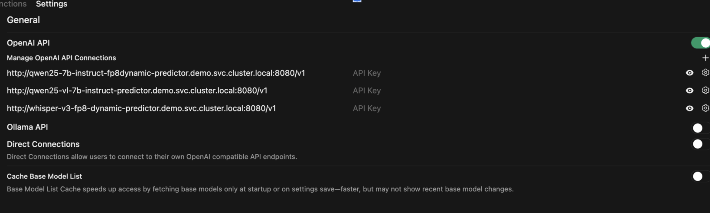
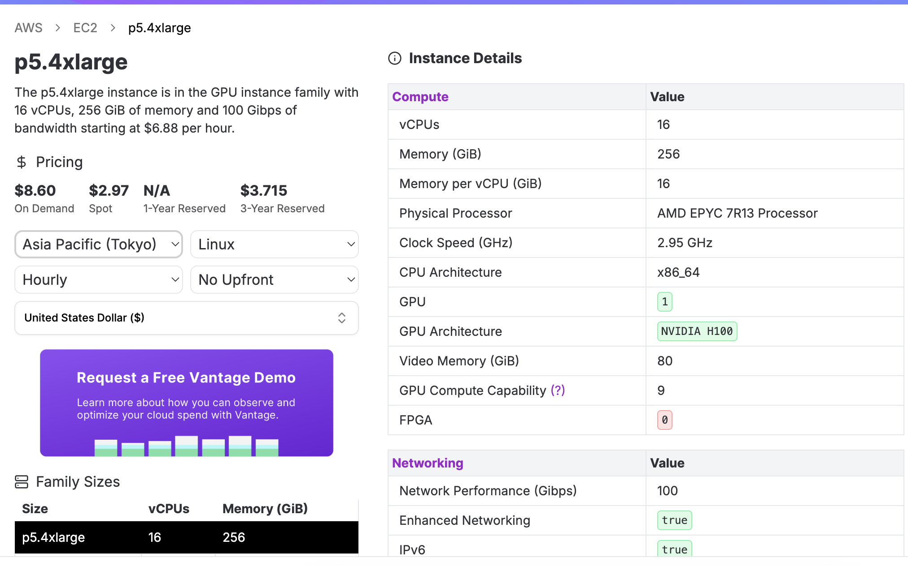

# Appendix

## Network policy to simulate air-gapped workloads

**Note:** With this policy, workbenches fail because pods cannot reach the Kubernetes API.

```yaml
kind: NetworkPolicy
apiVersion: networking.k8s.io/v1
metadata:
 name: block-egress
 namespace: demo
spec:
 podSelector: {}
 ingress:
   - from:
       - podSelector: {}
   - from:
       - namespaceSelector:
           matchLabels:
             kubernetes.io/metadata.name: openshift-dns
   - from:
       - namespaceSelector:
           matchLabels:
             network.openshift.io/policy-group: ingress
 egress:
   - to:
       - namespaceSelector:
           matchLabels:
             kubernetes.io/metadata.name: openshift-dns
       - podSelector: {}
   - to:
       - podSelector: {}
 policyTypes:
   - Ingress
   - Egress
```

## Configure Open WebUI for multiple endpoints

* Add under User \-\> Settings \-\> Admin Settings:



* Or reset Open WebUI to read from the ConfigMap again. Restart the pod to read from ConfigMap again. You can also use `scripts/update-model-open-webui.sh`

```yaml
kind: ConfigMap
apiVersion: v1
metadata:
  name: openwebui-config
  namespace: demo
data:
  OPENAI_API_BASE_URLS: 'http://qwen25-7b-instruct-fp8dynamic-predictor.demo.svc.cluster.local:8080/v1;http://qwen25-vl-7b-instruct-predictor.demo.svc.cluster.local:8080/v1;http://whisper-v3-fp8-dynamic-predictor.demo.svc.cluster.local:8080/v1'
```

Because we are setting `PERSISTENT_CONFIG=False`, you should not need to delete webui.db. Restarting the pod is sufficient.

```bash
OPEN_WEBUI=$(oc get pods -l app=open-webui -o custom-columns=NAME:.metadata.name --no-headers)

oc rsh $OPEN_WEBUI rm -rf /app/backend/data/webui.db

oc delete pod $OPEN_WEBUI
```

The various models will appear under the UI  


## AWS GPU instance types

**Note:** Pricing may not be accurate.




