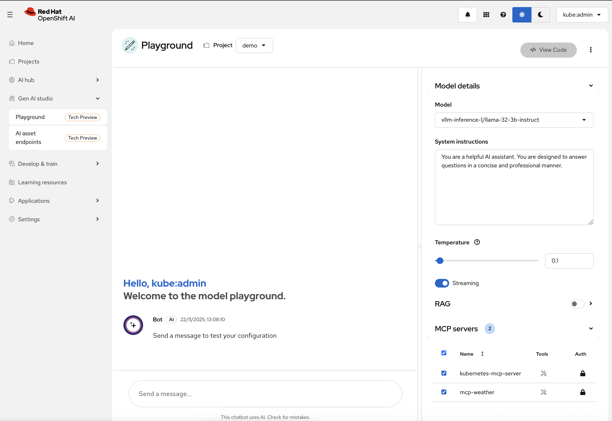
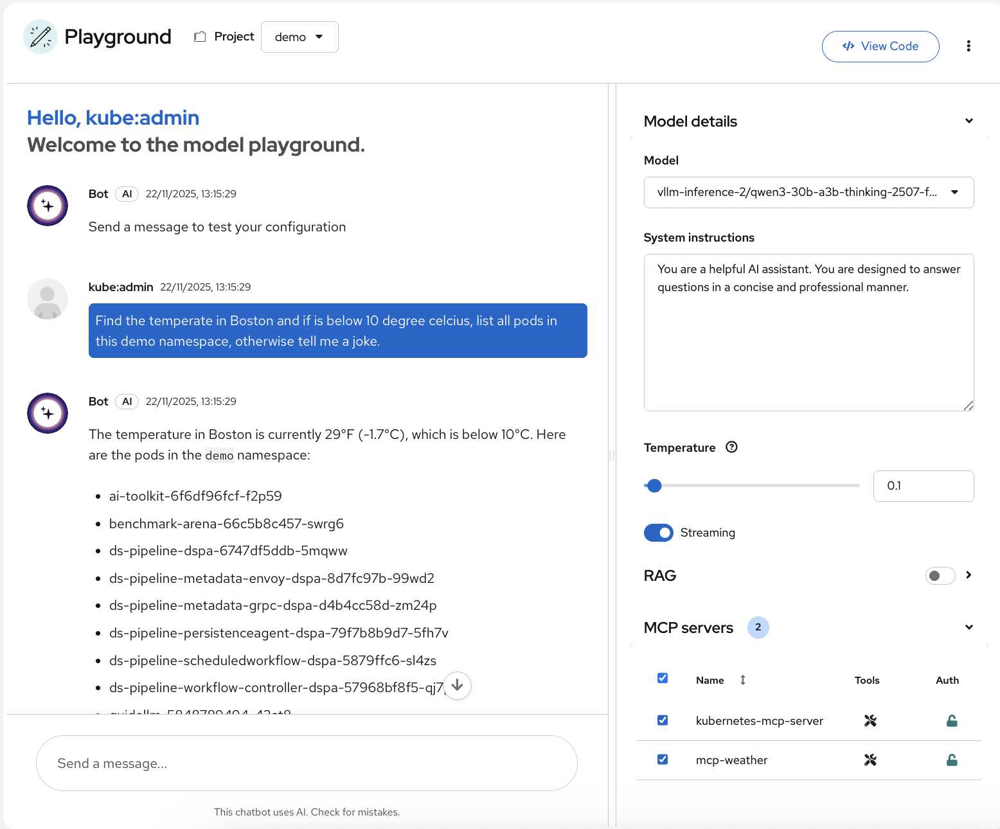
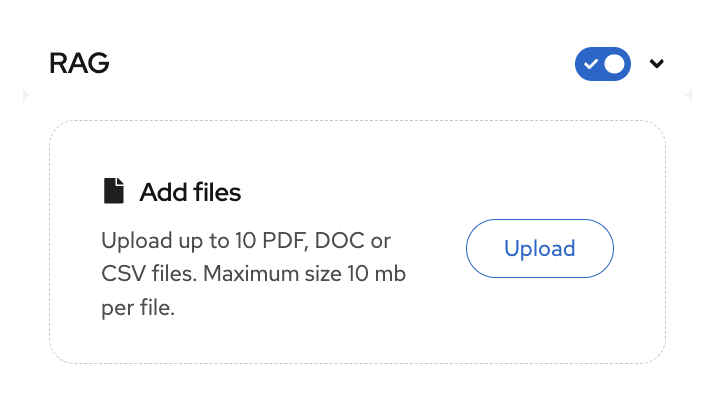
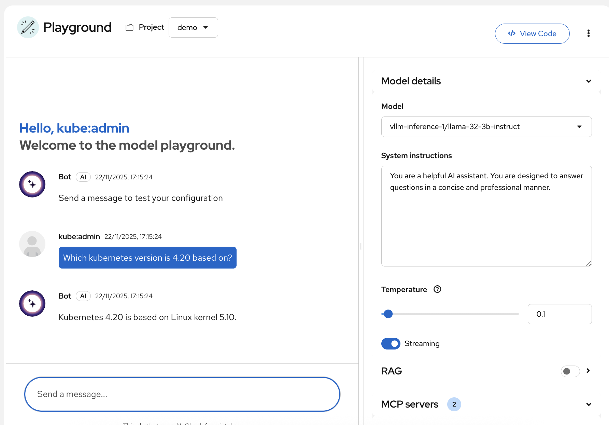
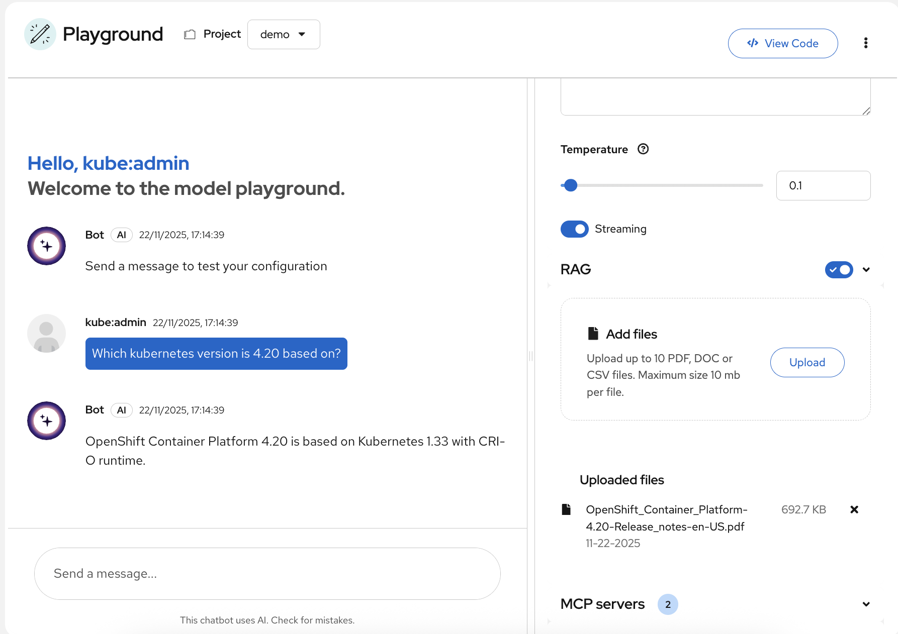

# AI Playground

**Note:** The AI playground is a Technology Preview feature in recent OpenShift AI releases.

The generative AI (gen AI) playground is an interactive environment within the Red Hat OpenShift AI dashboard where you can prototype and evaluate foundation models, custom models, and Model Control Protocol (MCP) servers before you use them in an application.

You can test different configurations, including retrieval augmented generation (RAG), to determine the right assets for your use-case. After you find an effective configuration, you can retrieve a Python template that serves as a starting point for building and iterating in a local development environment

Underneath the hood, it uses Llama Stack. Llama Stack enables LLM serving, RAG, tool-calling, vector databases and MCP integration within OpenShift AI Playground

Run the setup target:

``` bash
make setup-ai-playground
```

The target deploys MCP servers, Llama Stack configuration, and the gen AI playground workload in `demo`. Once deployment is done, you can access the AI playground from the OpenShift AI dashboard.



Enabling MCP Servers:

1. Select the MCP server(s) you want to use from the list (e.g., kubernetes-mcp-server or mcp-weather).
1. Click on the lock icon :lock: next to the MCP server name. The icon will unlock and turn green, indicating the server is now enabled.
1. Once enabled, the LLM can query these MCP servers to fetch external data or perform actions in real time. For example, the LLM can call mcp-weather to get current temperature data or kubernetes-mcp-server to list pods, deployments, or other resources.

Now you can chat with the LLM, asking questions that may involve real-time data from these MCP servers.

In the below example, the model correctly fetched the Boston temperature and then listed pods in the demo namespace using the enabled MCP servers.

> Find the temperate in Boston and if is below 10 degrees celcius, list all pods in this demo namespace, otherwise tell me a joke.



Using RAG:

1. You can toogle and enable RAG
1. Upload pdf and chat against the document.



In the below example, the OpenShift 4.20 [release notes](https://docs.redhat.com/en/documentation/openshift_container_platform/4.20/html/release_notes/ocp-4-20-release-notes) pdf was uploaded. It may take a while for the document to appear.

Before RAG:


Afer RAG:


