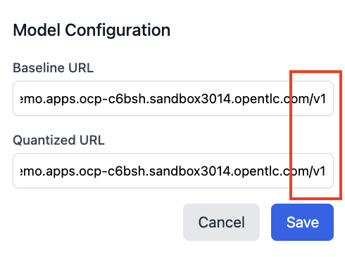
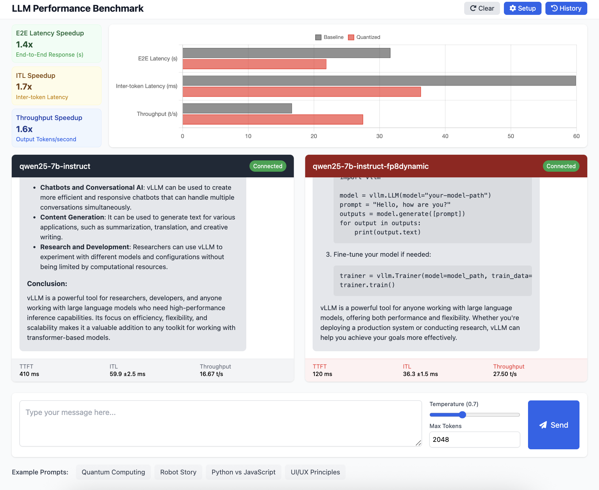

# Comparing Baseline and Compressed Models

* Obtain the benchmark arena endpoint

```bash
$ echo "https://$(oc get route benchmark-arena -o jsonpath='{.spec.host}')"
https://benchmark-arena-demo.apps.ocp-c6bsh.sandbox3014.opentlc.com
```

* Configure the benchmark arena with the v1 endpoints

```bash
$ echo "$(oc get isvc qwen25-7b-instruct -o jsonpath='{.status.url}')/v1"
https://qwen25-7b-instruct-demo.apps.ocp-c6bsh.sandbox3014.opentlc.com/v1

$ echo "$(oc get isvc qwen25-7b-instruct-fp8dynamic -o jsonpath='{.status.url}')/v1"
https://qwen25-7b-instruct-fp8dynamic-demo.apps.ocp-c6bsh.sandbox3014.opentlc.com/v1
```



A sample run between baseline and quantized models:


