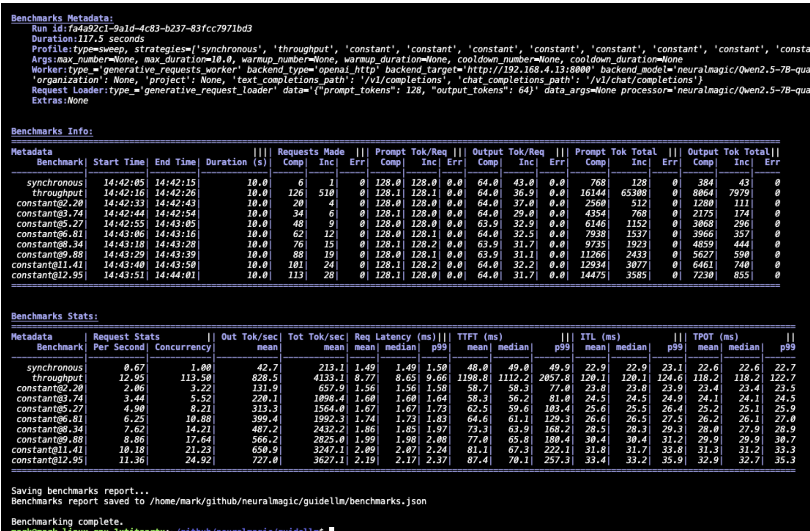

# Benchmarking using GuideLLM

* Run GuideLLM benchmark

```bash
$ GUIDELLM=$(oc get pod -l app=guidellm -o custom-columns=NAME:.metadata.name --no-headers)

$ oc rsh $GUIDELLM

$ rm -rf /opt/app-root/src/.cache
$ export TARGET=http://qwen25-7b-instruct-fp8dynamic-predictor.demo.svc.cluster.local:8080 
$ export MODEL=qwen25-7b-instruct-fp8dynamic

$ GUIDELLM__MAX_CONCURRENCY=8 \
guidellm benchmark run \
  --target $TARGET \
  --model $MODEL \
  --processor /mnt/models/RedHatAI/Qwen2.5-7B-Instruct-FP8-dynamic \
  --rate-type throughput \
  --max-requests 100 \
  --output-path /tmp/output.json \
  --data "prompt_tokens=768,output_tokens=768"
```



#### Token Metrics

Prompt Tokens and Counts

* Definition: The number of tokens in the input prompts sent to the LLM.
* Use Case: Useful for understanding the complexity of the input data and its impact on model performance.

Output Tokens and Counts

* Definition: The number of tokens generated by the LLM in response to the input prompts.
* Use Case: Helps evaluate the model's output length and its correlation with latency and resource usage.

#### Performance Metrics

| Metric                  | Definition                                                                 | Use Case                                                                                  |
|-------------------------|-----------------------------------------------------------------------------|------------------------------------------------------------------------------------------|
| Request Rate (RPS)       | The number of requests processed per second.                              | Indicates system throughput and its ability to handle concurrent workloads.              |
| Request Concurrency      | The number of requests being processed simultaneously.                     | Evaluates the system's capacity to handle parallel workloads.                            |
| Output Tokens Per Second | Average number of output tokens generated per second across all requests. | Measures efficiency in generating output tokens and overall server performance.          |
| Total Tokens Per Second  | Combined rate of prompt and output tokens processed per second.           | Assesses overall system performance for both input and output processing.                |
| Request Latency          | Time taken to process a single request, from start to finish.             | Evaluates responsiveness and user experience.                                            |
| Time to First Token (TTFT)| Time taken to generate the first token of the output.                     | Crucial for measuring initial response time, especially for user-facing applications.    |
| Inter-Token Latency (ITL) | Average time between generating consecutive output tokens, excluding the first token. | Assesses smoothness and speed of token generation.                                       |
| Time Per Output Token    | Average time taken to generate each output token, including the first token. | Provides detailed insights into token generation efficiency.                             |

