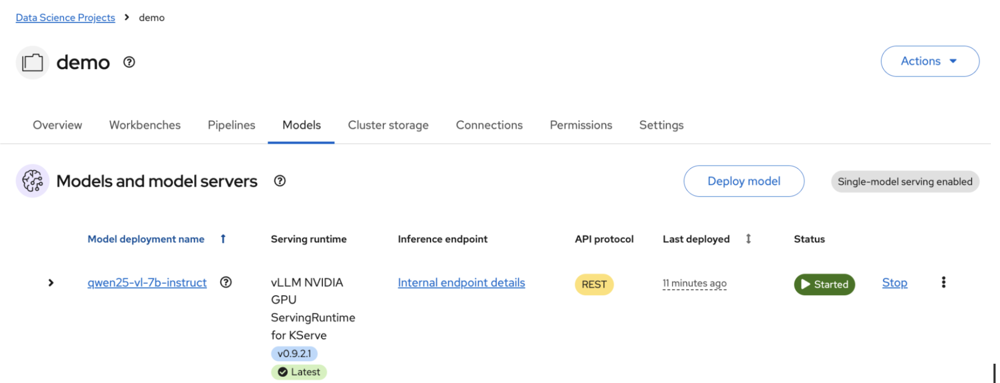

# Bring-Your-Own-Model

Download models to PVC storage for model serving.

If `HF_TOKEN` is required for gated models, you can prefix the command with `HF_TOKEN=<TOKEN> scripts/download-model.sh`. Note that this can be captured in your shell history.

* PVC. Stores the model on the pvc `models-pvc`.

```bash
scripts/download-model.sh pvc Qwen/Qwen2.5-VL-7B-Instruct
```

* Deploy the models using KServe from PVC or OCI
* Give a name. InferenceService name must consist of lower case alphanumeric characters or '-', and must start with alphabetical character. (e.g. "my-name" or "abc-123", regex used for validation is '\[a-z\](\[-a-z0-9\]\*\[a-z0-9\])?')

You can serve the model using PVC or OCI.

```bash
$ scripts/serve-model.sh -h
Usage: scripts/serve-model.sh [options] <name> <uri>

Examples:
  scripts/serve-model.sh qwen2.5-vl-7b-instruct \
    pvc://models-pvc/Qwen/Qwen2.5-VL-7B-Instruct \
    --vllm-args "--tensor-parallel-size 1 --max-model-len 4096"

  scripts/serve-model.sh qwen2.5-7b-instruct \
    oci://registry.redhat.io/rhelai1/modelcar-qwen2-5-7b-instruct-fp8-dynamic:1.5
```

* Observe the vLLM (kserve-container) logs

```bash
$ oc logs -f qwen25-vl-7b-instruct-predictor-774fffcb5c-fnwnf
Defaulted container "kserve-container" out of: kserve-container, storage-initializer (init)
INFO 08-31 08:01:25 [__init__.py:244] Automatically detected platform cuda.
INFO 08-31 08:01:29 [api_server.py:1413] vLLM API server version 0.9.0.1
INFO 08-31 08:01:29 [cli_args.py:325] non-default args: {'port': 8080, 'model': '/mnt/models', 'max_model_len': 2048, 'served_model_name': ['qwen25-vl-7b-instruct']}
INFO 08-31 08:01:42 [config.py:842] This model supports multiple tasks: {'reward', 'embed', 'classify', 'generate'}. Defaulting to 'generate'.
INFO 08-31 08:01:42 [config.py:1473] Using max model len 2048
INFO 08-31 08:01:42 [config.py:2286] Chunked prefill is enabled with max_num_batched_tokens=2048.
INFO 08-31 08:01:43 [core.py:526] Waiting for init message from front-end.
INFO 08-31 08:01:43 [core.py:69] Initializing a V1 LLM engine (v0.9.0.1) with config: model='/mnt/models', speculative_config=None, tokenizer='/mnt/models', skip_tokenizer_init=False, tokenizer_mode=auto, revision=None, override_neuron_config={}, tokenizer_revision=None, trust_remote_code=False, dtype=torch.bfloat16, max_seq_len=2048, download_dir=None, load_format=LoadFormat.AUTO, tensor_parallel_size=1, pipeline_parallel_size=1, disable_custom_all_reduce=False, quantization=None, enforce_eager=False, kv_cache_dtype=auto,  device_config=cuda, decoding_config=DecodingConfig(backend='auto', disable_fallback=False, disable_any_whitespace=False, disable_additional_properties=False, reasoning_backend=''), observability_config=ObservabilityConfig(show_hidden_metrics_for_version=None, otlp_traces_endpoint=None, collect_detailed_traces=None), seed=0, served_model_name=qwen25-vl-7b-instruct, num_scheduler_steps=1, multi_step_stream_outputs=True, enable_prefix_caching=True, chunked_prefill_enabled=True, use_async_output_proc=True, pooler_config=None, compilation_config={"level":3,"debug_dump_path":"","cache_dir":"","backend":"","custom_ops":[],"splitting_ops":["vllm.unified_attention","vllm.unified_attention_with_output"],"use_inductor":true,"compile_sizes":[],"inductor_compile_config":{"enable_auto_functionalized_v2":false},"inductor_passes":{},"use_cudagraph":true,"cudagraph_num_of_warmups":1,"cudagraph_capture_sizes":[512,504,496,488,480,472,464,456,448,440,432,424,416,408,400,392,384,376,368,360,352,344,336,328,320,312,304,296,288,280,272,264,256,248,240,232,224,216,208,200,192,184,176,168,160,152,144,136,128,120,112,104,96,88,80,72,64,56,48,40,32,24,16,8,4,2,1],"cudagraph_copy_inputs":false,"full_cuda_graph":false,"max_capture_size":512,"local_cache_dir":null}
INFO 08-31 08:01:45 [parallel_state.py:1076] rank 0 in world size 1 is assigned as DP rank 0, PP rank 0, TP rank 0, EP rank 0
WARNING 08-31 08:01:45 [profiling.py:271] The sequence length (2048) is smaller than the pre-defined wosrt-case total number of multimodal tokens (32768). This may cause certain multi-modal inputs to fail during inference. To avoid this, you should increase `max_model_len` or reduce `mm_counts`.
INFO 08-31 08:01:45 [topk_topp_sampler.py:49] Using FlashInfer for top-p & top-k sampling.
INFO 08-31 08:01:45 [gpu_model_runner.py:1770] Starting to load model /mnt/models...
INFO 08-31 08:01:46 [gpu_model_runner.py:1775] Loading model from scratch...
WARNING 08-31 08:01:46 [vision.py:91] Current `vllm-flash-attn` has a bug inside vision module, so we use xformers backend instead. You can run `pip install flash-attn` to use flash-attention backend.
INFO 08-31 08:01:46 [cuda.py:284] Using Flash Attention backend on V1 engine.
Loading safetensors checkpoint shards:   0% Completed | 0/5 [00:00<?, ?it/s]
Loading safetensors checkpoint shards:  20% Completed | 1/5 [00:28<01:55, 28.75s/it]
Loading safetensors checkpoint shards:  40% Completed | 2/5 [00:58<01:27, 29.18s/it]
Loading safetensors checkpoint shards:  60% Completed | 3/5 [01:27<00:58, 29.31s/it]
Loading safetensors checkpoint shards:  80% Completed | 4/5 [01:57<00:29, 29.38s/it]
Loading safetensors checkpoint shards: 100% Completed | 5/5 [01:59<00:00, 19.58s/it]
Loading safetensors checkpoint shards: 100% Completed | 5/5 [01:59<00:00, 23.88s/it]
INFO 08-31 08:03:45 [default_loader.py:272] Loading weights took 119.43 seconds
INFO 08-31 08:03:46 [gpu_model_runner.py:1801] Model loading took 15.6271 GiB and 119.639792 seconds
INFO 08-31 08:03:46 [gpu_model_runner.py:2238] Encoder cache will be initialized with a budget of 16384 tokens, and profiled with 1 image items of the maximum feature size.
Using a slow image processor as `use_fast` is unset and a slow processor was saved with this model. `use_fast=True` will be the default behavior in v4.52, even if the model was saved with a slow processor. This will result in minor differences in outputs. You'll still be able to use a slow processor with `use_fast=False`.
You have video processor config saved in `preprocessor.json` file which is deprecated. Video processor configs should be saved in their own `video_preprocessor.json` file. You can rename the file or load and save the processor back which renames it automatically. Loading from `preprocessor.json` will be removed in v5.0.
INFO 08-31 08:04:00 [backends.py:508] Using cache directory: /home/vllm/.cache/vllm/torch_compile_cache/060c74b053/rank_0_0/backbone for vLLM's torch.compile
INFO 08-31 08:04:00 [backends.py:519] Dynamo bytecode transform time: 5.34 s
INFO 08-31 08:04:02 [backends.py:181] Cache the graph of shape None for later use
[rank0]:W0831 08:04:03.629000 212 torch/_inductor/utils.py:1250] [0/0] Not enough SMs to use max_autotune_gemm mode
INFO 08-31 08:04:22 [backends.py:193] Compiling a graph for general shape takes 21.86 s
INFO 08-31 08:04:34 [monitor.py:34] torch.compile takes 27.21 s in total
INFO 08-31 08:04:35 [gpu_worker.py:232] Available KV cache memory: 1.81 GiB
INFO 08-31 08:04:36 [kv_cache_utils.py:716] GPU KV cache size: 33,824 tokens
INFO 08-31 08:04:36 [kv_cache_utils.py:720] Maximum concurrency for 2,048 tokens per request: 16.52x
Capturing CUDA graph shapes: 100%|██████████| 67/67 [00:32<00:00,  2.05it/s]
INFO 08-31 08:05:08 [gpu_model_runner.py:2326] Graph capturing finished in 33 secs, took 0.51 GiB
INFO 08-31 08:05:08 [core.py:172] init engine (profile, create kv cache, warmup model) took 82.83 seconds
INFO 08-31 08:05:09 [loggers.py:137] Engine 000: vllm cache_config_info with initialization after num_gpu_blocks is: 2114
WARNING 08-31 08:05:09 [config.py:1393] Default sampling parameters have been overridden by the model's Hugging Face generation config recommended from the model creator. If this is not intended, please relaunch vLLM instance with `--generation-config vllm`.
INFO 08-31 08:05:09 [serving_chat.py:125] Using default chat sampling params from model: {'repetition_penalty': 1.05, 'temperature': 1e-06}
INFO 08-31 08:05:09 [serving_completion.py:72] Using default completion sampling params from model: {'repetition_penalty': 1.05, 'temperature': 1e-06}
INFO 08-31 08:05:09 [api_server.py:1475] Starting vLLM API server 0 on http://0.0.0.0:8080
INFO 08-31 08:05:09 [launcher.py:29] Available routes are:
INFO 08-31 08:05:09 [launcher.py:37] Route: /openapi.json, Methods: HEAD, GET
INFO 08-31 08:05:09 [launcher.py:37] Route: /docs, Methods: HEAD, GET
INFO 08-31 08:05:09 [launcher.py:37] Route: /docs/oauth2-redirect, Methods: HEAD, GET
INFO 08-31 08:05:09 [launcher.py:37] Route: /redoc, Methods: HEAD, GET
INFO 08-31 08:05:09 [launcher.py:37] Route: /health, Methods: GET
INFO 08-31 08:05:09 [launcher.py:37] Route: /load, Methods: GET
INFO 08-31 08:05:09 [launcher.py:37] Route: /ping, Methods: POST
INFO 08-31 08:05:09 [launcher.py:37] Route: /ping, Methods: GET
INFO 08-31 08:05:09 [launcher.py:37] Route: /tokenize, Methods: POST
INFO 08-31 08:05:09 [launcher.py:37] Route: /detokenize, Methods: POST
INFO 08-31 08:05:09 [launcher.py:37] Route: /v1/models, Methods: GET
INFO 08-31 08:05:09 [launcher.py:37] Route: /version, Methods: GET
INFO 08-31 08:05:09 [launcher.py:37] Route: /v1/chat/completions, Methods: POST
INFO 08-31 08:05:09 [launcher.py:37] Route: /v1/completions, Methods: POST
INFO 08-31 08:05:09 [launcher.py:37] Route: /v1/embeddings, Methods: POST
INFO 08-31 08:05:09 [launcher.py:37] Route: /pooling, Methods: POST
INFO 08-31 08:05:09 [launcher.py:37] Route: /classify, Methods: POST
INFO 08-31 08:05:09 [launcher.py:37] Route: /score, Methods: POST
INFO 08-31 08:05:09 [launcher.py:37] Route: /v1/score, Methods: POST
INFO 08-31 08:05:09 [launcher.py:37] Route: /v1/audio/transcriptions, Methods: POST
INFO 08-31 08:05:09 [launcher.py:37] Route: /v1/audio/translations, Methods: POST
INFO 08-31 08:05:09 [launcher.py:37] Route: /rerank, Methods: POST
INFO 08-31 08:05:09 [launcher.py:37] Route: /v1/rerank, Methods: POST
INFO 08-31 08:05:09 [launcher.py:37] Route: /v2/rerank, Methods: POST
INFO 08-31 08:05:09 [launcher.py:37] Route: /invocations, Methods: POST
INFO 08-31 08:05:09 [launcher.py:37] Route: /metrics, Methods: GET
INFO:     Started server process [1]
INFO:     Waiting for application startup.
INFO:     Application startup complete.
INFO:     Uvicorn running on http://0.0.0.0:8080 (Press CTRL+C to quit)
```

* Important information about vLLM deployment:
  * Arguments
  * Model sizing
  * Available KV cache and maximum concurrency based on default/max-model-len setting

```text
INFO 08-31 08:01:29 [cli_args.py:325] non-default args: {'port': 8080, 'model': '/mnt/models', 'max_model_len': 2048, 'served_model_name': ['qwen25-vl-7b-instruct']}
INFO 08-31 08:03:46 [gpu_model_runner.py:1801] Model loading took 15.6271 GiB and 119.639792 seconds
INFO 08-31 08:04:35 [gpu_worker.py:232] Available KV cache memory: 1.81 GiB
INFO 08-31 08:04:36 [kv_cache_utils.py:716] GPU KV cache size: 33,824 tokens
INFO 08-31 08:04:36 [kv_cache_utils.py:720] Maximum concurrency for 2,048 tokens per request: 16.52x
```

* OpenShift AI console with the model deployed



* Verify the GPU memory usage

```bash
$ oc rsh qwen25-vl-7b-instruct-predictor-774fffcb5c-fnwnf /bin/bash
Defaulted container "kserve-container" out of: kserve-container, storage-initializer (init)
[1000880000@qwen25-vl-7b-instruct-predictor-774fffcb5c-fnwnf ~]$ nvidia-smi
Sun Aug 31 08:09:35 2025
+-----------------------------------------------------------------------------------------+
| NVIDIA-SMI 570.148.08             Driver Version: 570.148.08     CUDA Version: 12.8     |
|-----------------------------------------+------------------------+----------------------+
| GPU  Name                 Persistence-M | Bus-Id          Disp.A | Volatile Uncorr. ECC |
| Fan  Temp   Perf          Pwr:Usage/Cap |           Memory-Usage | GPU-Util  Compute M. |
|                                         |                        |               MIG M. |
|=========================================+========================+======================|
|   0  NVIDIA L4                      On  |   00000000:3A:00.0 Off |                    0 |
| N/A   54C    P0             36W /   72W |   19370MiB /  23034MiB |      0%      Default |
|                                         |                        |                  N/A |
+-----------------------------------------+------------------------+----------------------+

+-----------------------------------------------------------------------------------------+
| Processes:                                                                              |
|  GPU   GI   CI              PID   Type   Process name                        GPU Memory |
|        ID   ID                                                               Usage      |
|=========================================================================================|
|    0   N/A  N/A             212      C   python                                19362MiB |
+-----------------------------------------------------------------------------------------+
```
