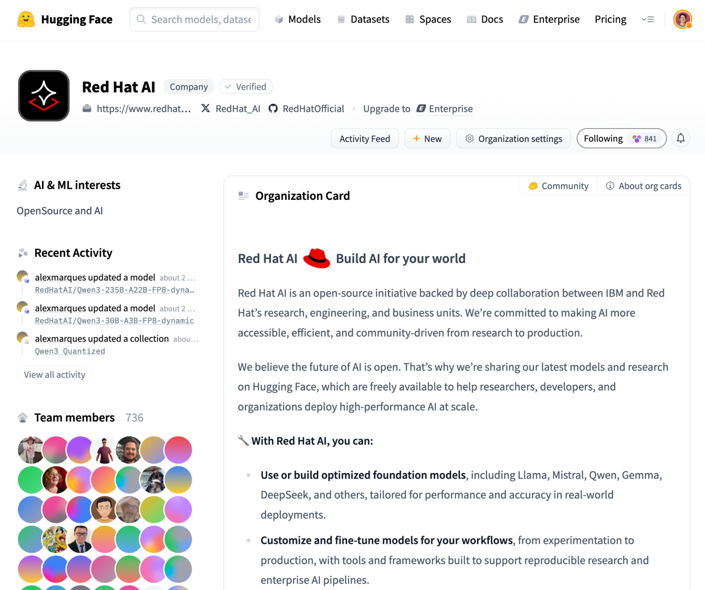

# Deploying Compressed Model

Organizations are increasingly adopting private AI to maintain data privacy and control, but scaling inference remains a major challenge due to performance and resource demands. Open source LLMs now rival closed models, and through optimization techniques like quantization, sparsity, and pruning, enterprises can dramatically cut model size, speed up response times, and reduce infrastructure costs without sacrificing accuracy. Real-world examples from companies like LinkedIn and Roblox show how compressed models enable scalable, cost-effective AI deployments. With Red Hat’s [repository](https://huggingface.co/RedHatAI) of pre-optimized models and tools like LLM Compressor, teams can easily customize and deploy efficient LLMs across hybrid cloud environments using technologies like vLLM.



* Download the model

```bash
scripts/download-model.sh pvc RedHatAI/Qwen2.5-7B-Instruct-FP8-dynamic
```

* Serving the model

```bash
scripts/serve-model.sh qwen25-7b-instruct-fp8dynamic \
  pvc://models-pvc/RedHatAI/Qwen2.5-7B-Instruct-FP8-dynamic
```

