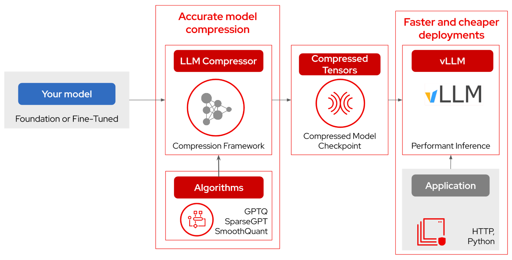
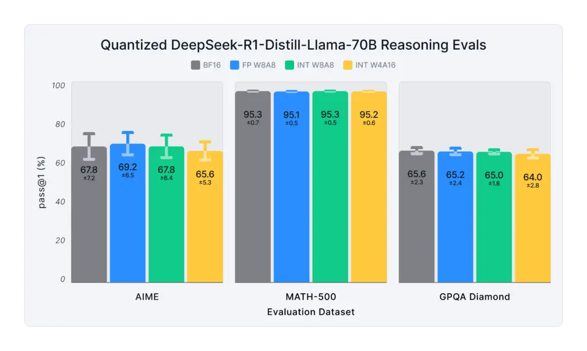
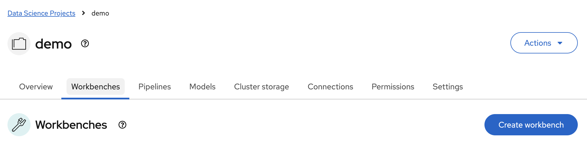
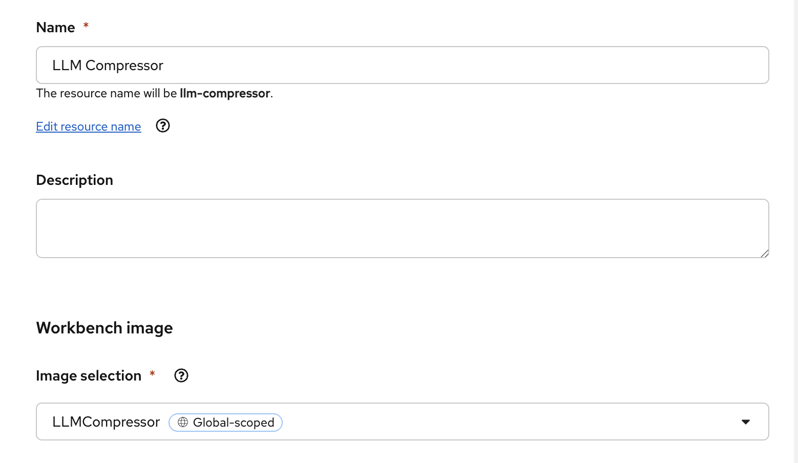
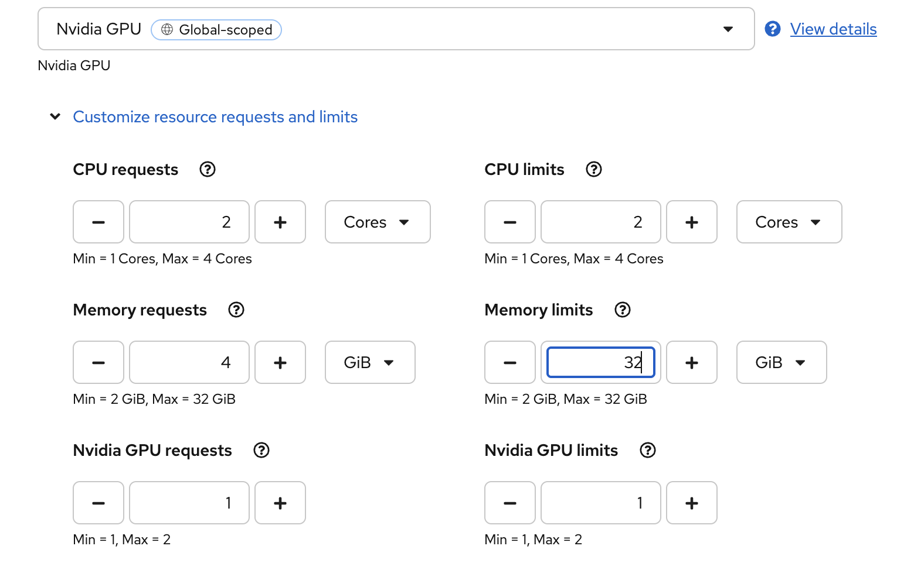
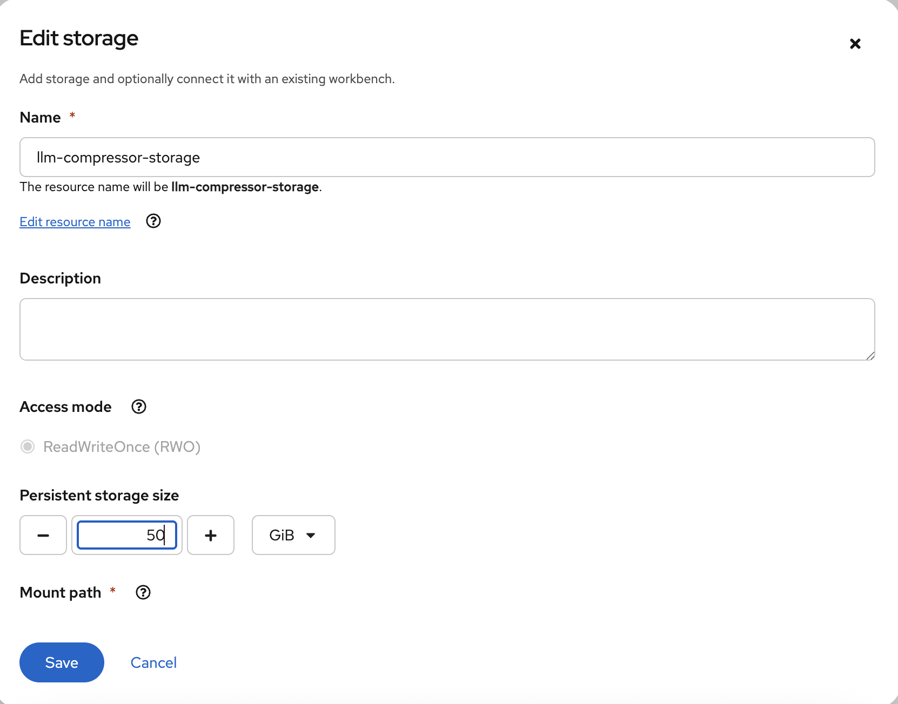
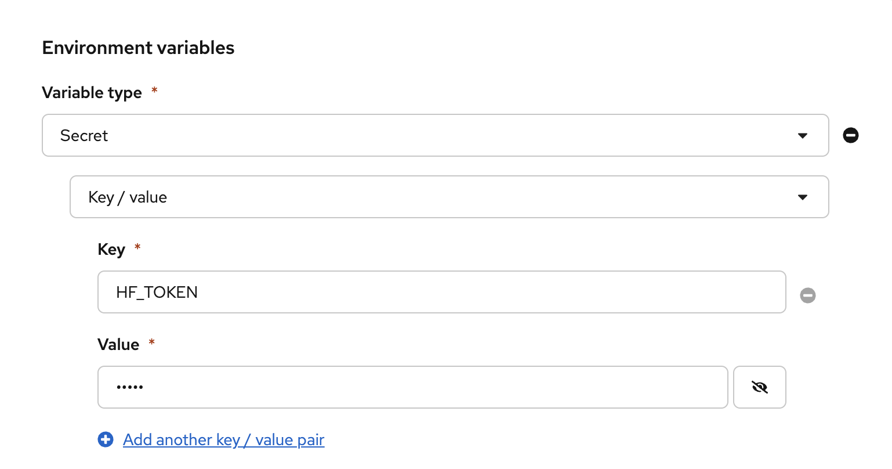
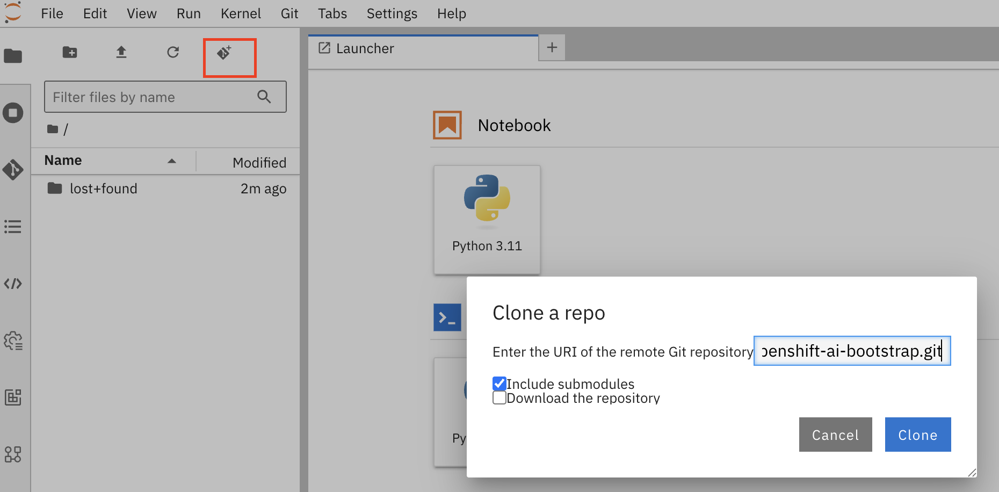
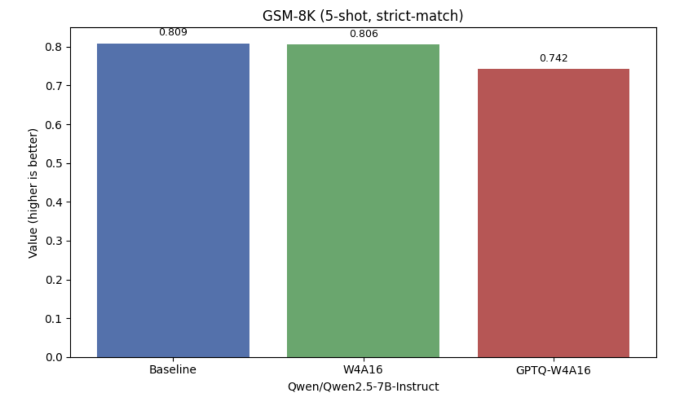
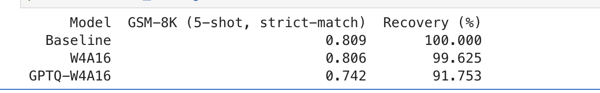

# Using LLM Compressor

[LLM Compressor](https://github.com/vllm-project/llm-compressor) supports a wide range of optimization strategies that address different deployment needs. Weight-only schemes like W4A16 are well suited for memory-constrained, low-QPS scenarios. Full quantization using INT8 or FP8 is ideal for high-throughput, compute-intensive deployments. For reducing model size further, 2:4 structured sparsity can be applied. In long-context workloads, quantizing the KV Cache offers additional memory savings.



Pass@1 score and standard deviation for quantized models on the popular reasoning benchmarks:



Under the `demo` data science project, create a new workbench.



* Use the `LLMCompressor` workbench image
* Use the `Nvidia GPU` hardware profile. Change memory limits to 32GiB
* Change storage to 50GiB
* If necessary, add your `HF_TOKEN` token to the workbench









#### Login to the workbench

* Inside the workbench, clone the repository
`https://github.com/tsailiming/openshift-ai-bootstrap.git`



* After cloning, checkout the `rhoai-3` branch using the UI or terninal within the workbench:

```bash
git checkout -b rhoai-3 origin/rhoai-3
```

* Run `src/llm-compressor/llm-compressor-demo.ipynb`

The notebook will run the model through W4A16 and GPTQ-W4A16 compression and evaluate using GSM8K. GSM8K (Grade School Math 8K) is a dataset of 8.5K high quality linguistically diverse grade school math word problems. The dataset was created to support the task of question answering on basic mathematical problems that require multi-step reasoning.





Here are some[examples](https://github.com/vllm-project/llm-compressor/tree/main/examples) for quantizing models.

