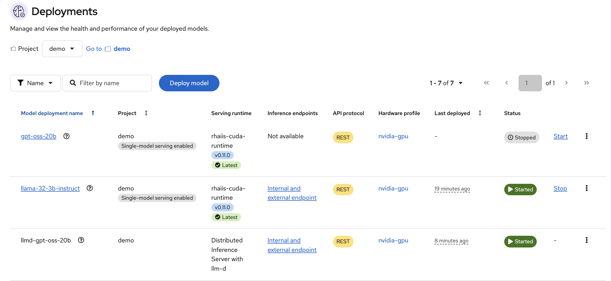
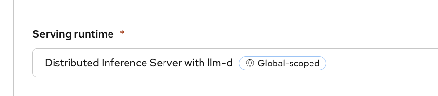

# Distributed Inference with llm-d

Distributed Inference with llm-d is a Kubernetes-native, open-source framework designed for serving large language models (LLMs) at scale. You can use Distributed Inference with llm-d to simplify the deployment of generative AI, focusing on high performance and cost-effectiveness across various hardware accelerators.

KServe and llm-d components are enabled when you run `make setup-rhoai`. There is no separate `setup-llmd` Makefile target; apply the sample manifests under `yaml/demo/`.

To deploy `openai/gpt-oss-20b` using `LLMInferenceService` with the following configurations:

* Model: openai/gpt-oss-20b using ModelCar
* Replicas: 2
* GPU per replica: 1
* Scheduler: [Intelligent Inference Scheduling](https://llm-d.ai/docs/guide/Installation/inference-scheduling)

``` bash
oc apply -f yaml/demo/llmisvc-gptoss-20b.yaml
```



Use curl to test the endpoint:

``` bash
curl -k "$(oc get llmisvc llmd-gptoss-20b -n demo -o jsonpath='{.status.addresses[0].url}')"/v1/models | jq  
{
  "object": "list",
  "data": [
    {
      "id": "openai/gpt-oss-20b",
      "object": "model",
      "created": 1763917221,
      "owned_by": "vllm",
      "root": "/mnt/models",
      "parent": null,
      "max_model_len": 131072,
      "permission": [
        {
          "id": "modelperm-772dd72788de4e2f8afd8ad8499ac052",
          "object": "model_permission",
          "created": 1763917221,
          "allow_create_engine": false,
          "allow_sampling": true,
          "allow_logprobs": true,
          "allow_search_indices": false,
          "allow_view": true,
          "allow_fine_tuning": false,
          "organization": "*",
          "group": null,
          "is_blocking": false
        }
      ]
    }
  ]
}
```

If you are getting `Internal Server Error` from curl, remove the `enable-auth` annotation and reapply the yaml it.

``` yaml
apiVersion: serving.kserve.io/v1alpha1
kind: LLMInferenceService
metadata:
  annotations:    
    security.opendatahub.io/enable-auth: 'false'
```

You can use the dashboard to deploy the model, choose `Distributed Inference Server with llm-d`.



**Note:** There is a known [issue](https://issues.redhat.com/browse/RHOAIENG-38896) when setting vLLM arguments in the dashboard will break the deployment. To customize the vLLM arguments, add them to the `VLLM_ADDITIONAL_ARGS` environment variable. Do not add to the custom runtime arguments.

More examples:

1. Single-node GPU [deployment](https://github.com/red-hat-data-services/kserve/blob/main/docs/samples/llmisvc/single-node-gpu/README.md): Use single-GPU-per-replica deployment patterns for development, testing, or production deployments of smaller models, such as 7-billion-parameter models.

1. Multi-node deployment: For examples using multi-node deployments, see DeepSeek-R1 multi-node deployment [examples](https://github.com/red-hat-data-services/kserve/blob/main/docs/samples/llmisvc/dp-ep/deepseek-r1-gpu-rdma-roce/README.md).

1. Intelligent inference scheduler with KV cache routing [deployment](https://github.com/red-hat-data-services/kserve/blob/main/docs/samples/llmisvc/precise-prefix-kv-cache-routing/README.md): You can configure the scheduler to track key-value (KV) cache blocks across inference endpoints and route requests to the endpoint with the highest cache hit rate. This configuration improves throughput and reduces latency by maximizing cache reuse.

1. Add the annotation `security.opendatahub.io/enable-auth: 'false'` to the `llmisvc` resource to disable authentication.

