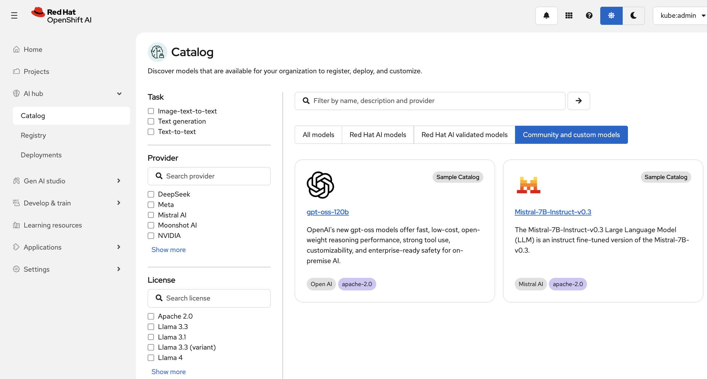
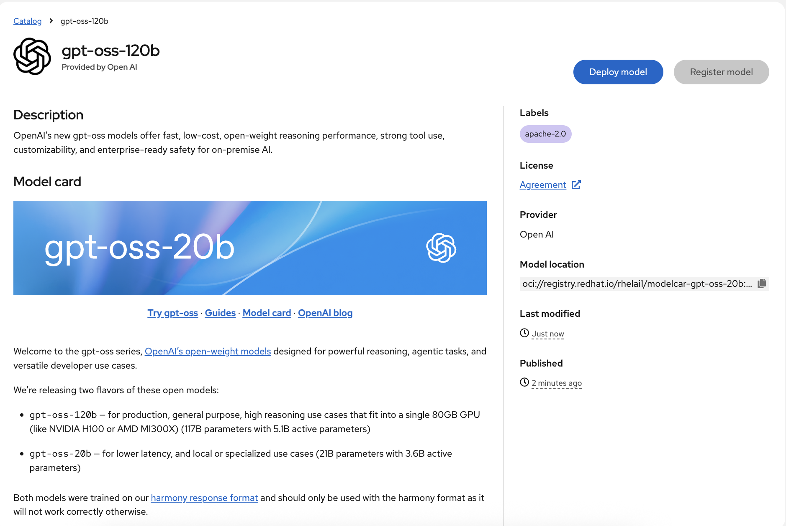
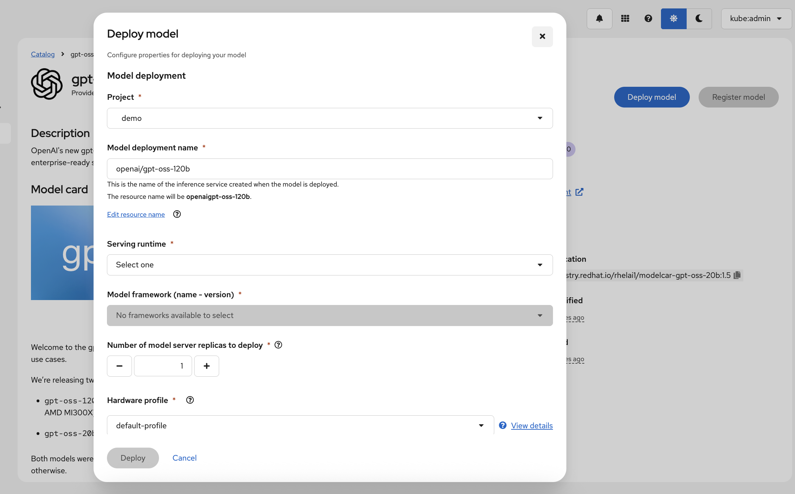

# Model Catalog

The OpenShift AI Model Catalog enables data scientists to easily discover and evaluate a wide range of AI models that are ready for their organization. Users can search for models from multiple providers, assess their suitability, and then register them in a model registry for deployment and customization. This streamlined process helps data scientists efficiently identify and utilize the best models for their use cases.

Administrators play a key role in managing the model catalog. OpenShift AI administrators can configure which repository sources are displayed in the catalog, ensuring that only approved or relevant models are visible. 

A sample custom catalog has already been configured during the demo [setup](yaml/demo/custom-model-catalog.yaml): 

| Model Name                         | Model Location                                                         |
|------------------------------------|-------------------------------------------------------------------------|
| mistralai/Mistral-7B-Instruct-v0.3 | hf://mistralai/Mistral-7B-Instruct-v0.3                                |
| openai/gpt-oss-20b                | oci://registry.redhat.io/rhelai1/modelcar-gpt-oss-20b:1.5              |

``` yaml
kind: ConfigMap
apiVersion: v1
metadata:
  name: model-catalog-sources
  namespace: rhoai-model-registries
  labels:
    app: model-catalog
    app.kubernetes.io/component: model-catalog
    app.kubernetes.io/created-by: model-registry-operator
    app.kubernetes.io/instance: model-catalog
    app.kubernetes.io/managed-by: model-registry-operator
    app.kubernetes.io/name: model-catalog
    app.kubernetes.io/part-of: model-catalog
    component: model-catalog  
data:
  sample-catalog.yaml: |-
    source: Hugging Face
    models:
    - name: openai/gpt-oss-20b
      description: OpenAI's new gpt-oss models offer fast, low-cost, open-weight reasoning performance, strong tool use, customizability, and enterprise-ready safety for on-premise AI.
      readme: |-
        <readme from model card>
      provider: Open AI
      logo: data:image/png;base64, <base64 string of image>
      license: apache-2.0
      licenseLink: https://www.apache.org/licenses/LICENSE-2.0.txt
      libraryName: transformers
      artifacts:
        - uri: oci://registry.redhat.io/rhelai1/modelcar-gpt-oss-20b:1.5          
  sources.yaml: |-
    catalogs:
    - name: Sample Catalog
      id: sample_custom_catalog
      type: yaml
      enabled: true
      properties:
        yamlCatalogPath: sample-catalog.yaml

```





You can also deploy the model into your project from the model card page.



