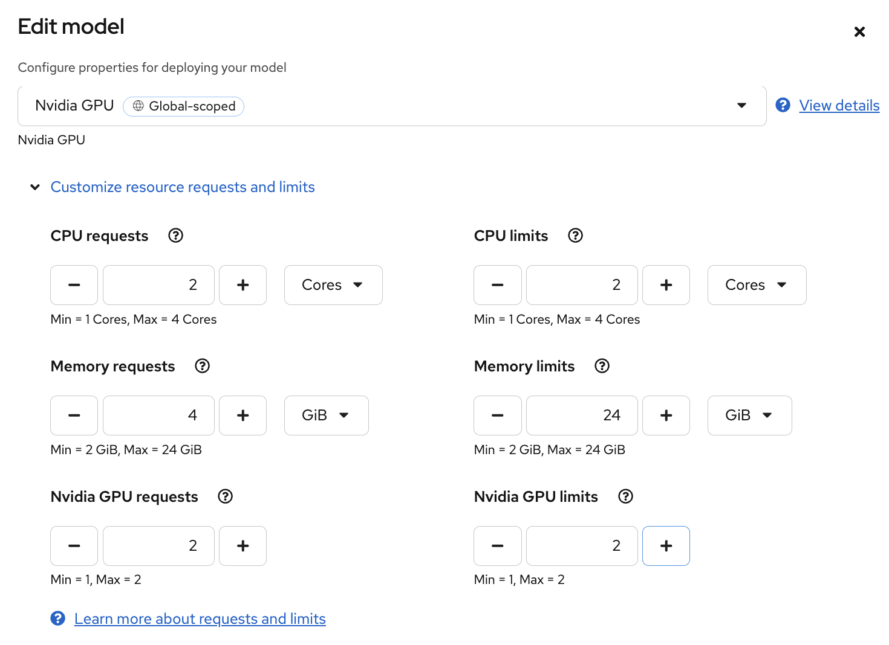

# Using Multi-GPU Tensor Parallelism

* Patch the InferenceService and vLLM arguments to use 2 GPUs

```bash
oc patch isvc qwen25-vl-7b-instruct -n demo --type merge -p '{
  "spec": {
    "predictor": {
      "model": {
        "args": [
          "--max-model-len", "8192",
          "--tensor-parallel-size", "2"
        ],
        "resources": {
          "limits": {
            "nvidia.com/gpu": "2"
          },
          "requests": {
            "nvidia.com/gpu": "2"
          }
        }
      }
    }
  }
}'

```

* Or manually edit the model in the OpenShift AI dashboard

Assign 2 GPUs to the model:



Add `--tensor-parallel-size 2` to the model paramaters


* Pod logs with 2 workers

```text
INFO 08-31 14:41:53 [cli_args.py:325] non-default args: {'port': 8080, 'model': '/mnt/models', 'max_model_len': 8192, 'served_model_name': ['qwen25-vl-7b-instruct'], 'tensor_parallel_size': 2}
[1;36m(VllmWorker rank=1 pid=219)[0;0m INFO 08-31 14:42:32 [parallel_state.py:1076] rank 1 in world size 2 is assigned as DP rank 0, PP rank 0, TP rank 1, EP rank 1
[1;36m(VllmWorker rank=0 pid=218)[0;0m INFO 08-31 14:42:32 [parallel_state.py:1076] rank 0 in world size 2 is assigned as DP rank 0, PP rank 0, TP rank 0, EP rank 0
[1;36m(VllmWorker rank=1 pid=219)[0;0m INFO 08-31 14:45:44 [gpu_worker.py:232] Available KV cache memory: 10.04 GiB
[1;36m(VllmWorker rank=0 pid=218)[0;0m INFO 08-31 14:45:44 [gpu_worker.py:232] Available KV cache memory: 10.04 GiB
INFO 08-31 14:45:45 [kv_cache_utils.py:716] GPU KV cache size: 375,968 tokens
INFO 08-31 14:45:45 [kv_cache_utils.py:720] Maximum concurrency for 8,192 tokens per request: 45.89x
INFO 08-31 14:45:45 [kv_cache_utils.py:716] GPU KV cache size: 375,968 tokens
INFO 08-31 14:45:45 [kv_cache_utils.py:720] Maximum concurrency for 8,192 tokens per 
request: 45.89x
```

* Pod nvidia-smi output

```bash
$ oc rsh qwen25-vl-7b-instruct-predictor-7565b969b-jt8jk nvidia-smi
Defaulted container "kserve-container" out of: kserve-container, storage-initializer (init)
Sun Aug 31 14:52:22 2025
+-----------------------------------------------------------------------------------------+
| NVIDIA-SMI 570.148.08             Driver Version: 570.148.08     CUDA Version: 12.8     |
|-----------------------------------------+------------------------+----------------------+
| GPU  Name                 Persistence-M | Bus-Id          Disp.A | Volatile Uncorr. ECC |
| Fan  Temp   Perf          Pwr:Usage/Cap |           Memory-Usage | GPU-Util  Compute M. |
|                                         |                        |               MIG M. |
|=========================================+========================+======================|
|   0  NVIDIA L4                      On  |   00000000:3C:00.0 Off |                    0 |
| N/A   60C    P0             36W /   72W |   20304MiB /  23034MiB |      0%      Default |
|                                         |                        |                  N/A |
+-----------------------------------------+------------------------+----------------------+
|   1  NVIDIA L4                      On  |   00000000:3E:00.0 Off |                    0 |
| N/A   58C    P0             35W /   72W |   20304MiB /  23034MiB |      0%      Default |
|                                         |                        |                  N/A |
+-----------------------------------------+------------------------+----------------------+

+-----------------------------------------------------------------------------------------+
| Processes:                                                                              |
|  GPU   GI   CI              PID   Type   Process name                        GPU Memory |
|        ID   ID                                                               Usage      |
|=========================================================================================|
|    0   N/A  N/A             218      C   python                                20296MiB |
|    1   N/A  N/A             219      C   python                                20296MiB |
+-----------------------------------------------------------------------------------------+
```

