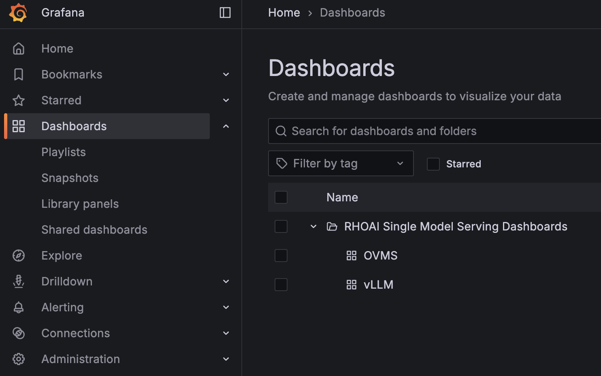
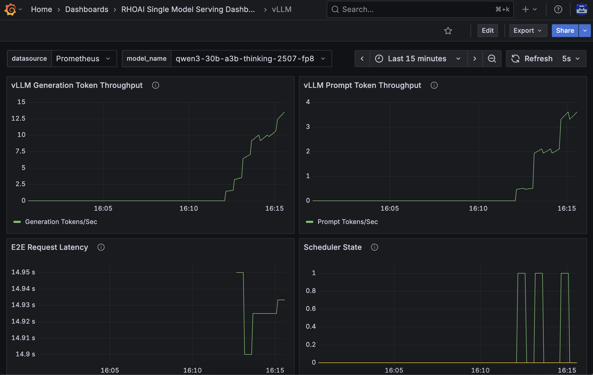

> **Note:** `make setup-rhoai` already installs the Grafana operator and DCGM dashboard ConfigMap. The steps below add RHOAI UWM dashboards from [rhoai-uwm](https://github.com/rh-aiservices-bu/rhoai-uwm).

# Observability

Install the Grafana operator and add the dashboards:

``` bash
$ git clone https://github.com/rh-aiservices-bu/rhoai-uwm
$ cd rhoai-uwm
$ oc apply -k rhoai-uwm-grafana/overlays/rhoai-uwm-user-grafana-app
namespace/user-grafana unchanged
clusterrole.rbac.authorization.k8s.io/grafana-proxy unchanged
rolebinding.rbac.authorization.k8s.io/grafana-proxy unchanged
clusterrolebinding.rbac.authorization.k8s.io/cluster-monitoring-view-user-grafana unchanged
configmap/ocp-injected-certs unchanged
secret/grafana-auth-secret created
secret/grafana-proxy unchanged
grafana.grafana.integreatly.org/grafana created
grafanadashboard.grafana.integreatly.org/ovms-dashboard created
grafanadashboard.grafana.integreatly.org/vllm-dashboard created
grafanadatasource.grafana.integreatly.org/prometheus-grafanadatasource created
grafanafolder.grafana.integreatly.org/rhoai-single-model-serving-dashboards created
operatorgroup.operators.coreos.com/user-grafana unchanged
subscription.operators.coreos.com/grafana unchanged
```

You may encouter the followig error because the operator takes time to install. Just rerun the `oc apply -k`

``` bash
resource mapping not found for name: "grafana" namespace: "user-grafana" from "overlays/rhoai-uwm-user-grafana-app": no matches for kind "Grafana" in version "grafana.integreatly.org/v1beta1"
ensure CRDs are installed first
resource mapping not found for name: "ovms-dashboard" namespace: "user-grafana" from "overlays/rhoai-uwm-user-grafana-app": no matches for kind "GrafanaDashboard" in version "grafana.integreatly.org/v1beta1"
ensure CRDs are installed first
resource mapping not found for name: "vllm-dashboard" namespace: "user-grafana" from "overlays/rhoai-uwm-user-grafana-app": no matches for kind "GrafanaDashboard" in version "grafana.integreatly.org/v1beta1"
ensure CRDs are installed first
resource mapping not found for name: "prometheus-grafanadatasource" namespace: "user-grafana" from "overlays/rhoai-uwm-user-grafana-app": no matches for kind "GrafanaDatasource" in version "grafana.integreatly.org/v1beta1"
ensure CRDs are installed first
resource mapping not found for name: "rhoai-single-model-serving-dashboards" namespace: "user-grafana" from "overlays/rhoai-uwm-user-grafana-app": no matches for kind "GrafanaFolder" in version "grafana.integreatly.org/v1beta1"
ensure CRDs are installed first
```

The grafana dashboard is installed in `user-grafana` namespace and url is available here:

``` bash
$ echo "https://$(oc get route grafana-route -o jsonpath='{.spec.host}' -n user-grafana)"
https://grafana-route-user-grafana.apps.f8ki3.sandbox1605.opentlc.com
https://grafana-route-user-grafana.apps.f8ki3.sandbox1605.opentlc.com
```





