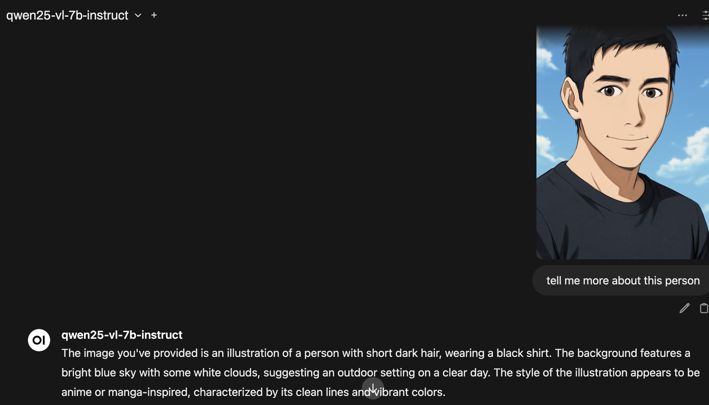

# Integration using OpenAI-compatible endpoint

* Obtain the InferenceService name

```bash
$ oc get isvc -o custom-columns=NAME:.metadata.name --no-headers -n demo

qwen25-7b-instruct
qwen25-vl-7b-instruct
```

* Configure Open WebUI to use the OpenAI-compatible endpoint.

You can use multiple URLs by using the comma delimiter  
[https://github.com/tsailiming/openshift-open-webui/blob/main/open-webui.yaml\#L21-L22](https://github.com/tsailiming/openshift-open-webui/blob/main/open-webui.yaml#L21-L22)

If the model does not appear, you may have to configure it manually in the UI, or [reset](../appendix.md#configure-open-webui-for-multiple-endpoints) the configuration so it picks up the new endpoints.

```bash
# scripts/update-model-open-webui.sh <isvc name>
$ sh scripts/update-model-open-webui.sh qwen25-7b-instruct
Model URL: http://qwen25-7b-instruct-predictor.demo.svc.cluster.local:8080/v1
Model ID: qwen25-7b-instruct
Updating ConfigMap with new model url
configmap/openwebui-config patched
Restarting OpenWebUI deployment...
deployment.apps/open-webui restarted
```

```bash
$ oc get cm openwebui-config -n demo -o yaml
apiVersion: v1
data:
  ENABLE_OLLAMA_API: "False"
  OPENAI_API_BASE_URLS: http://qwen25-vl-7b-instruct-predictor.demo.svc.cluster.local:8080/v1
  OPENAI_API_KEYS: ""
  VECTOR_DB: chroma
  VECTOR_DB_URL: chromadb://local
  WEBUI_SECRET_KEY: your-secret-key
kind: ConfigMap
metadata:
  name: openwebui-config
  namespace: demo
```

* Chat with the model using the route

```bash
$ echo "https://$(oc get route open-webui -o jsonpath='{.spec.host}')"
https://open-webui-demo.apps.ocp-c6bsh.sandbox3014.opentlc.com
```



