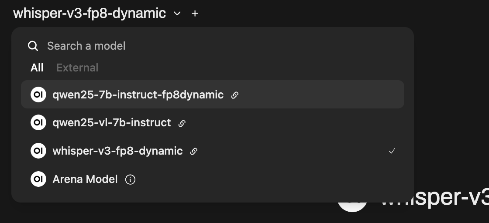
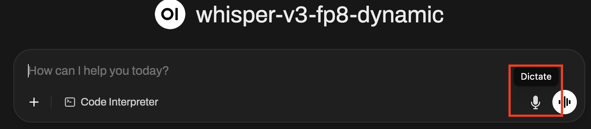
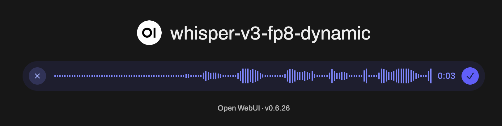
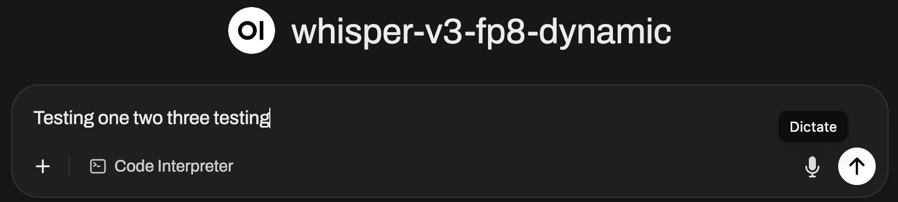

# Speech-to-Text using Whisper

* Download model to PVC

```bash
$ scripts/download-model.sh pvc RedHatAI/whisper-large-v3-turbo-FP8-dynamic
job.batch/download-models-pvc created
Waiting for job download-models-pvc to complete...
Job download-models-pvc completed successfully.
```

* Serve the model

```bash
$ scripts/serve-model.sh whisper-v3-fp8-dynamic \
  pvc://models-pvc/RedHatAI/whisper-large-v3-turbo-FP8-dynamic
servingruntime.serving.kserve.io/whisper-v3-fp8-dynamic created
inferenceservice.serving.kserve.io/whisper-v3-fp8-dynamic created
```

* Configure Open WebUI

```bash
scripts/update-model-open-webui.sh whisper-v3-fp8-dynamic
```

* Switch to the Whisper model



Note: If the Whisper model is not shown, you can add it manually or just [reset](../appendix.md#configure-open-webui-for-multiple-endpoints) Open WebUI

* Perform Speech-to-Text using Open WebUI







